# Diagramas de classes do Backend (Express + Mongoose)

Cada módulo do Backend segue a cadeia **controller -> service -> repository -> model**. O Backend não calcula regras numéricas: delega ao Servidor Java (operações puras) por meio do `javaServerClient`, e consome a Pluggy (Open Finance) por meio do `pluggyClient`.

## Convenções (padrão Astah / UML 2)

- Visibilidade: `+` público, `-` privado, `#` protegido, `~` pacote. Atributo: `- nome: Tipo`. Operação: `+ nome(param: Tipo): Retorno`.
- Estereótipos: «interface», «enumeration», «service», «controller», «repository», «document», «dto», «router», «module», «planejado» (elemento que ainda não existe no código).
- Relações: generalização (`--|>`), realização (`..|>`), associação (`-->`), agregação (`o--`), composição (`*--`), dependência (`..>`).
- Cada diagrama aparece em dois blocos: `mermaid` (renderiza no GitHub) e `plantuml` (mesmo conteúdo, para recriar no Astah).
- Módulos TypeScript sem classe entram como classe «module». Schemas zod entram como classes «dto» ou em nota, e o tipo derivado (`XxxDto`) é a classe com atributos.
- Elementos «planejado» seguem `docs/especificacao-contas-e-transferencias.md` e não existem no código.

Índice:

1. Aplicação HTTP e infraestrutura
2. Cliente do Servidor Java (pool de conexões)
3. Integrações externas (Pluggy, IA, e-mail)
4. Autenticação e conta
5. Suporte
6. Transações (camadas e regra)
7. Transações (DTOs e validação)
8. Contas conectadas (Pluggy)
9. Painel
10. Metas
11. Cartões e parcelamentos
12. Portfólio simulado (feature futura na interface)
13. Mentor IA: chat
14. Mentor IA: alertas
15. Contas e transferências «planejado»

---

## 1. Backend — aplicação HTTP e infraestrutura

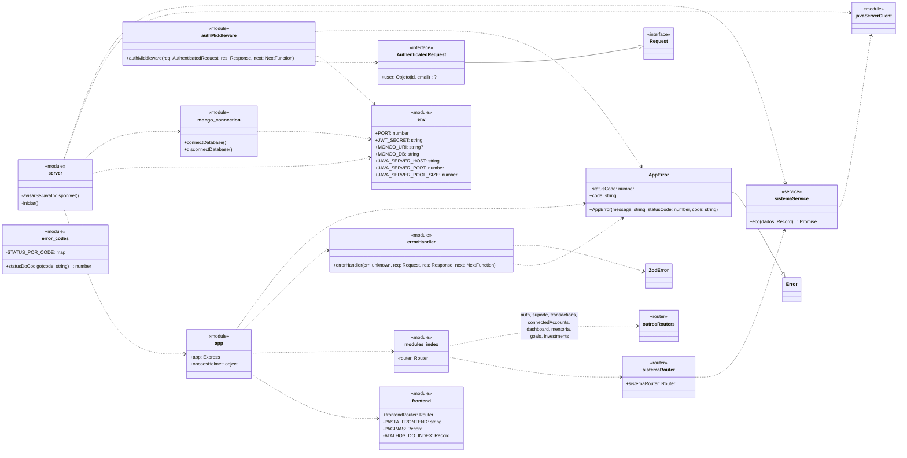
```mermaid
classDiagram
direction LR
class app {
  <<module>>
  +app: Express
  +opcoesHelmet: object
}
class server {
  <<module>>
  -avisarSeJavaIndisponivel()
  -iniciar()
}
class frontend {
  <<module>>
  +frontendRouter: Router
  -PASTA_FRONTEND: string
  -PAGINAS: Record
  -ATALHOS_DO_INDEX: Record
}
class env {
  <<module>>
  +PORT: number
  +JWT_SECRET: string
  +MONGO_URI: string?
  +MONGO_DB: string
  +JAVA_SERVER_HOST: string
  +JAVA_SERVER_PORT: number
  +JAVA_SERVER_POOL_SIZE: number
}
class mongo_connection {
  <<module>>
  +connectDatabase()
  +disconnectDatabase()
}
class modules_index {
  <<module>>
  -router: Router
}
class sistemaRouter {
  <<router>>
  +sistemaRouter: Router
}
class sistemaService {
  <<service>>
  +eco(dados: Record): Promise
}
class javaServerClient {
  <<module>>
}
class authMiddleware {
  <<module>>
  +authMiddleware(req: AuthenticatedRequest, res: Response, next: NextFunction)
}
class AuthenticatedRequest {
  <<interface>>
  +user: Objeto(id, email)?
}
class Request {
  <<interface>>
}
class errorHandler {
  <<module>>
  +errorHandler(err: unknown, req: Request, res: Response, next: NextFunction)
}
class AppError {
  +statusCode: number
  +code: string
  +AppError(message: string, statusCode: number, code: string)
}
class Error
class error_codes {
  <<module>>
  -STATUS_POR_CODE: map
  +statusDoCodigo(code: string): number
}
class ZodError
class outrosRouters {
  <<router>>
}
server ..> app
server ..> env
server ..> mongo_connection
server ..> javaServerClient
server ..> sistemaService
app ..> frontend
app ..> modules_index
app ..> errorHandler
app ..> AppError
modules_index ..> sistemaRouter
modules_index ..> outrosRouters : auth, suporte, transactions, connectedAccounts, dashboard, mentorIa, goals, investments
sistemaRouter ..> sistemaService
sistemaService ..> javaServerClient
mongo_connection ..> env
authMiddleware ..> AuthenticatedRequest
authMiddleware ..> env
authMiddleware ..> AppError
AuthenticatedRequest --|> Request
errorHandler ..> AppError
errorHandler ..> ZodError
AppError --|> Error
```

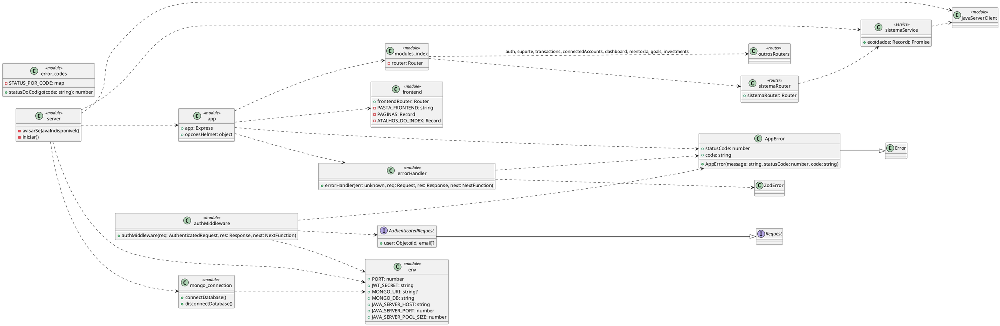
```plantuml
@startuml
left to right direction
class app <<module>> {
  +app: Express
  +opcoesHelmet: object
}
class server <<module>> {
  -avisarSeJavaIndisponivel()
  -iniciar()
}
class frontend <<module>> {
  +frontendRouter: Router
  -PASTA_FRONTEND: string
  -PAGINAS: Record
  -ATALHOS_DO_INDEX: Record
}
class env <<module>> {
  +PORT: number
  +JWT_SECRET: string
  +MONGO_URI: string?
  +MONGO_DB: string
  +JAVA_SERVER_HOST: string
  +JAVA_SERVER_PORT: number
  +JAVA_SERVER_POOL_SIZE: number
}
class mongo_connection <<module>> {
  +connectDatabase()
  +disconnectDatabase()
}
class modules_index <<module>> {
  -router: Router
}
class sistemaRouter <<router>> {
  +sistemaRouter: Router
}
class sistemaService <<service>> {
  +eco(dados: Record): Promise
}
class javaServerClient <<module>>
class authMiddleware <<module>> {
  +authMiddleware(req: AuthenticatedRequest, res: Response, next: NextFunction)
}
interface AuthenticatedRequest {
  +user: Objeto(id, email)?
}
interface Request
class errorHandler <<module>> {
  +errorHandler(err: unknown, req: Request, res: Response, next: NextFunction)
}
class AppError {
  +statusCode: number
  +code: string
  +AppError(message: string, statusCode: number, code: string)
}
class Error
class error_codes <<module>> {
  -STATUS_POR_CODE: map
  +statusDoCodigo(code: string): number
}
class ZodError
class outrosRouters <<router>>
server ..> app
server ..> env
server ..> mongo_connection
server ..> javaServerClient
server ..> sistemaService
app ..> frontend
app ..> modules_index
app ..> errorHandler
app ..> AppError
modules_index ..> sistemaRouter
modules_index ..> outrosRouters : auth, suporte, transactions, connectedAccounts, dashboard, mentorIa, goals, investments
sistemaRouter ..> sistemaService
sistemaService ..> javaServerClient
mongo_connection ..> env
authMiddleware ..> AuthenticatedRequest
authMiddleware ..> env
authMiddleware ..> AppError
AuthenticatedRequest --|> Request
errorHandler ..> AppError
errorHandler ..> ZodError
AppError --|> Error
@enduml
```

---

## 2. Backend — cliente do Servidor Java (pool de conexões)

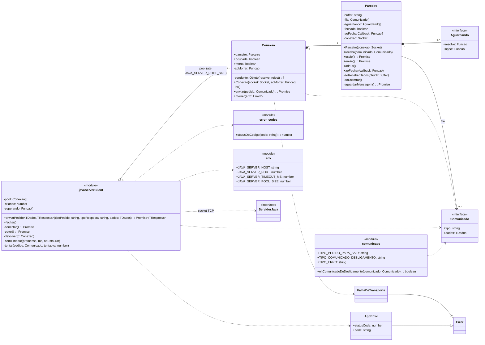
```mermaid
classDiagram
direction LR
class javaServerClient {
  <<module>>
  -pool: Conexao[]
  -criando: number
  -esperando: Funcao[]
  +enviarPedido~TDados,TResposta~(tipoPedido: string, tipoResposta: string, dados: TDados): Promise~TResposta~
  +fechar()
  -conectar(): Promise
  -obter(): Promise
  -devolver(c: Conexao)
  -comTimeout(promessa, ms, aoEstourar)
  -tentar(pedido: Comunicado, tentativa: number)
}
class Conexao {
  +parceiro: Parceiro
  +ocupada: boolean
  +morta: boolean
  -pendente: Objeto(resolve, reject)?
  -aoMorrer: Funcao
  +Conexao(socket: Socket, aoMorrer: Funcao)
  -ler()
  +enviar(pedido: Comunicado): Promise
  +morrer(erro: Error?)
}
class Parceiro {
  -buffer: string
  -fila: Comunicado[]
  -aguardando: Aguardando[]
  -fechado: boolean
  -aoFecharCallback: Funcao?
  -conexao: Socket
  +Parceiro(conexao: Socket)
  +receba(comunicado: Comunicado)
  +espie(): Promise
  +envie(): Promise
  +adeus()
  +aoFechar(callback: Funcao)
  -aoReceberDados(chunk: Buffer)
  -aoEncerrar()
  -aguardarMensagem(): Promise
}
class Aguardando {
  <<interface>>
  +resolve: Funcao
  +reject: Funcao
}
class Comunicado {
  <<interface>>
  +tipo: string
  +dados: TDados
}
class comunicado {
  <<module>>
  +TIPO_PEDIDO_PARA_SAIR: string
  +TIPO_COMUNICADO_DESLIGAMENTO: string
  +TIPO_ERRO: string
  +ehComunicadoDeDesligamento(comunicado: Comunicado): boolean
}
class FalhaDeTransporte
class Error
class AppError {
  +statusCode: number
  +code: string
}
class error_codes {
  <<module>>
  +statusDoCodigo(code: string): number
}
class env {
  <<module>>
  +JAVA_SERVER_HOST: string
  +JAVA_SERVER_PORT: number
  +JAVA_SERVER_TIMEOUT_MS: number
  +JAVA_SERVER_POOL_SIZE: number
}
class ServidorJava {
  <<interface>>
}
javaServerClient "1" o-- "0..*" Conexao : pool (ate JAVA_SERVER_POOL_SIZE)
Conexao "1" *-- "1" Parceiro
Parceiro "1" *-- "0..*" Aguardando
Parceiro --> "0..*" Comunicado : fila
Conexao ..> Comunicado
Conexao ..> FalhaDeTransporte
javaServerClient ..> Comunicado
javaServerClient ..> env
javaServerClient ..> AppError
javaServerClient ..> error_codes
javaServerClient ..> ServidorJava : socket TCP
comunicado ..> Comunicado
FalhaDeTransporte --|> Error
AppError --|> Error
```

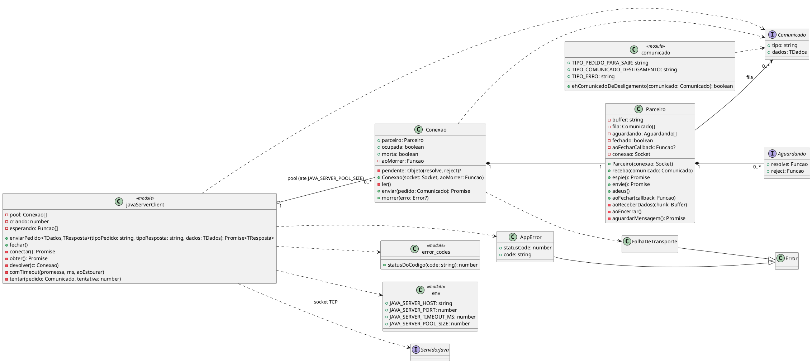
```plantuml
@startuml
left to right direction
class javaServerClient <<module>> {
  -pool: Conexao[]
  -criando: number
  -esperando: Funcao[]
  +enviarPedido<TDados,TResposta>(tipoPedido: string, tipoResposta: string, dados: TDados): Promise<TResposta>
  +fechar()
  -conectar(): Promise
  -obter(): Promise
  -devolver(c: Conexao)
  -comTimeout(promessa, ms, aoEstourar)
  -tentar(pedido: Comunicado, tentativa: number)
}
class Conexao {
  +parceiro: Parceiro
  +ocupada: boolean
  +morta: boolean
  -pendente: Objeto(resolve, reject)?
  -aoMorrer: Funcao
  +Conexao(socket: Socket, aoMorrer: Funcao)
  -ler()
  +enviar(pedido: Comunicado): Promise
  +morrer(erro: Error?)
}
class Parceiro {
  -buffer: string
  -fila: Comunicado[]
  -aguardando: Aguardando[]
  -fechado: boolean
  -aoFecharCallback: Funcao?
  -conexao: Socket
  +Parceiro(conexao: Socket)
  +receba(comunicado: Comunicado)
  +espie(): Promise
  +envie(): Promise
  +adeus()
  +aoFechar(callback: Funcao)
  -aoReceberDados(chunk: Buffer)
  -aoEncerrar()
  -aguardarMensagem(): Promise
}
interface Aguardando {
  +resolve: Funcao
  +reject: Funcao
}
interface Comunicado {
  +tipo: string
  +dados: TDados
}
class comunicado <<module>> {
  +TIPO_PEDIDO_PARA_SAIR: string
  +TIPO_COMUNICADO_DESLIGAMENTO: string
  +TIPO_ERRO: string
  +ehComunicadoDeDesligamento(comunicado: Comunicado): boolean
}
class FalhaDeTransporte
class Error
class AppError {
  +statusCode: number
  +code: string
}
class error_codes <<module>> {
  +statusDoCodigo(code: string): number
}
class env <<module>> {
  +JAVA_SERVER_HOST: string
  +JAVA_SERVER_PORT: number
  +JAVA_SERVER_TIMEOUT_MS: number
  +JAVA_SERVER_POOL_SIZE: number
}
interface ServidorJava
javaServerClient "1" o-- "0..*" Conexao : pool (ate JAVA_SERVER_POOL_SIZE)
Conexao "1" *-- "1" Parceiro
Parceiro "1" *-- "0..*" Aguardando
Parceiro --> "0..*" Comunicado : fila
Conexao ..> Comunicado
Conexao ..> FalhaDeTransporte
javaServerClient ..> Comunicado
javaServerClient ..> env
javaServerClient ..> AppError
javaServerClient ..> error_codes
javaServerClient ..> ServidorJava : socket TCP
comunicado ..> Comunicado
FalhaDeTransporte --|> Error
AppError --|> Error
@enduml
```

---

## 3. Backend — integrações externas (Pluggy, IA, e-mail)

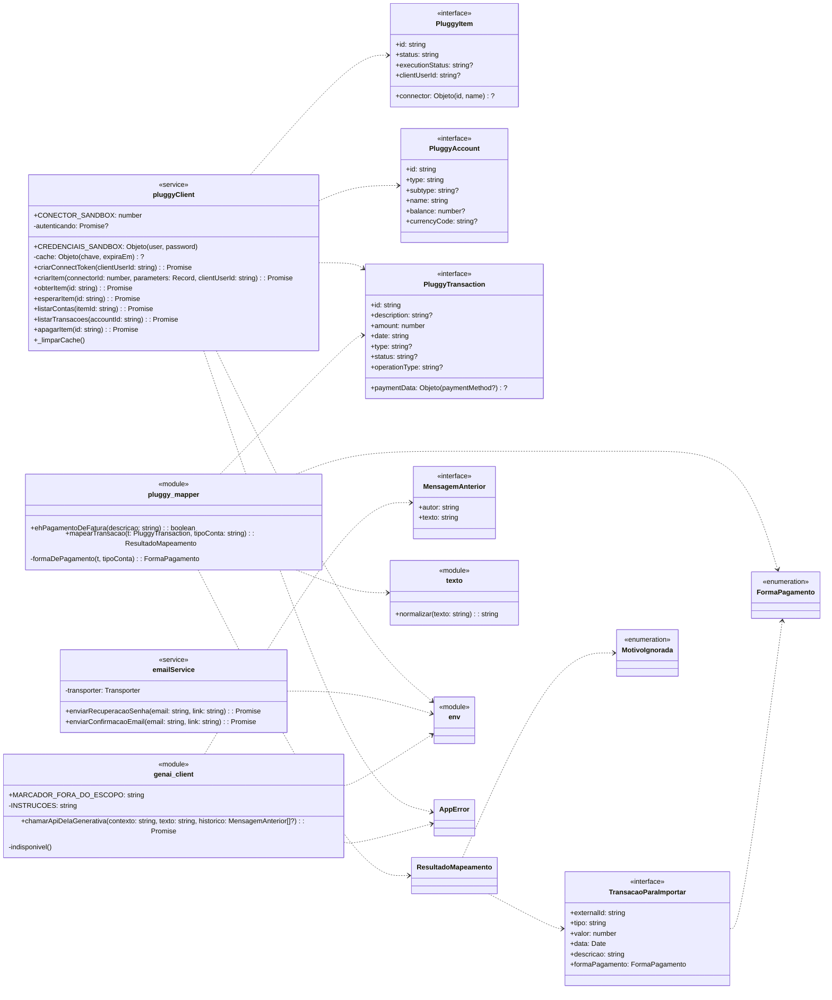
```mermaid
classDiagram
direction LR
class pluggyClient {
  <<service>>
  +CONECTOR_SANDBOX: number
  +CREDENCIAIS_SANDBOX: Objeto(user, password)
  -cache: Objeto(chave, expiraEm)?
  -autenticando: Promise?
  +criarConnectToken(clientUserId: string): Promise
  +criarItem(connectorId: number, parameters: Record, clientUserId: string): Promise
  +obterItem(id: string): Promise
  +esperarItem(id: string): Promise
  +listarContas(itemId: string): Promise
  +listarTransacoes(accountId: string): Promise
  +apagarItem(id: string): Promise
  +_limparCache()
}
class pluggy_mapper {
  <<module>>
  +ehPagamentoDeFatura(descricao: string): boolean
  +mapearTransacao(t: PluggyTransaction, tipoConta: string): ResultadoMapeamento
  -formaDePagamento(t, tipoConta): FormaPagamento
}
class PluggyItem {
  <<interface>>
  +id: string
  +status: string
  +executionStatus: string?
  +clientUserId: string?
  +connector: Objeto(id, name)?
}
class PluggyAccount {
  <<interface>>
  +id: string
  +type: string
  +subtype: string?
  +name: string
  +balance: number?
  +currencyCode: string?
}
class PluggyTransaction {
  <<interface>>
  +id: string
  +description: string?
  +amount: number
  +date: string
  +type: string?
  +status: string?
  +operationType: string?
  +paymentData: Objeto(paymentMethod?)?
}
class TransacaoParaImportar {
  <<interface>>
  +externalId: string
  +tipo: string
  +valor: number
  +data: Date
  +descricao: string
  +formaPagamento: FormaPagamento
}
class MotivoIgnorada {
  <<enumeration>>
}
class ResultadoMapeamento
class FormaPagamento {
  <<enumeration>>
}
class emailService {
  <<service>>
  -transporter: Transporter
  +enviarRecuperacaoSenha(email: string, link: string): Promise
  +enviarConfirmacaoEmail(email: string, link: string): Promise
}
class genai_client {
  <<module>>
  +MARCADOR_FORA_DO_ESCOPO: string
  -INSTRUCOES: string
  +chamarApiDeIaGenerativa(contexto: string, texto: string, historico: MensagemAnterior[]?): Promise
  -indisponivel()
}
class MensagemAnterior {
  <<interface>>
  +autor: string
  +texto: string
}
class texto {
  <<module>>
  +normalizar(texto: string): string
}
class env {
  <<module>>
}
class AppError
pluggyClient ..> env
pluggyClient ..> AppError
pluggyClient ..> PluggyItem
pluggyClient ..> PluggyAccount
pluggyClient ..> PluggyTransaction
pluggy_mapper ..> PluggyTransaction
pluggy_mapper ..> FormaPagamento
pluggy_mapper ..> texto
pluggy_mapper ..> ResultadoMapeamento
ResultadoMapeamento ..> TransacaoParaImportar
ResultadoMapeamento ..> MotivoIgnorada
TransacaoParaImportar ..> FormaPagamento
emailService ..> env
genai_client ..> MensagemAnterior
genai_client ..> AppError
genai_client ..> env
```

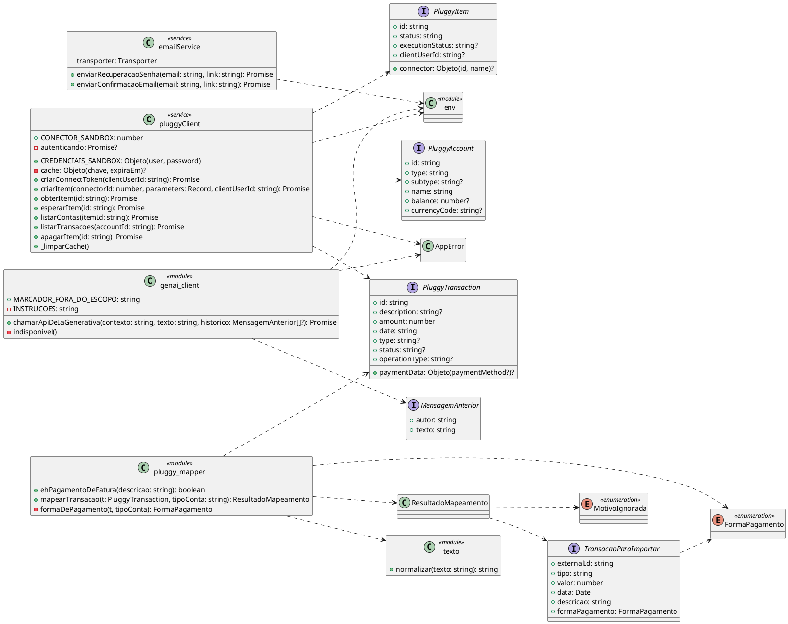
```plantuml
@startuml
left to right direction
class pluggyClient <<service>> {
  +CONECTOR_SANDBOX: number
  +CREDENCIAIS_SANDBOX: Objeto(user, password)
  -cache: Objeto(chave, expiraEm)?
  -autenticando: Promise?
  +criarConnectToken(clientUserId: string): Promise
  +criarItem(connectorId: number, parameters: Record, clientUserId: string): Promise
  +obterItem(id: string): Promise
  +esperarItem(id: string): Promise
  +listarContas(itemId: string): Promise
  +listarTransacoes(accountId: string): Promise
  +apagarItem(id: string): Promise
  +_limparCache()
}
class pluggy_mapper <<module>> {
  +ehPagamentoDeFatura(descricao: string): boolean
  +mapearTransacao(t: PluggyTransaction, tipoConta: string): ResultadoMapeamento
  -formaDePagamento(t, tipoConta): FormaPagamento
}
interface PluggyItem {
  +id: string
  +status: string
  +executionStatus: string?
  +clientUserId: string?
  +connector: Objeto(id, name)?
}
interface PluggyAccount {
  +id: string
  +type: string
  +subtype: string?
  +name: string
  +balance: number?
  +currencyCode: string?
}
interface PluggyTransaction {
  +id: string
  +description: string?
  +amount: number
  +date: string
  +type: string?
  +status: string?
  +operationType: string?
  +paymentData: Objeto(paymentMethod?)?
}
interface TransacaoParaImportar {
  +externalId: string
  +tipo: string
  +valor: number
  +data: Date
  +descricao: string
  +formaPagamento: FormaPagamento
}
enum MotivoIgnorada <<enumeration>>
class ResultadoMapeamento
enum FormaPagamento <<enumeration>>
class emailService <<service>> {
  -transporter: Transporter
  +enviarRecuperacaoSenha(email: string, link: string): Promise
  +enviarConfirmacaoEmail(email: string, link: string): Promise
}
class genai_client <<module>> {
  +MARCADOR_FORA_DO_ESCOPO: string
  -INSTRUCOES: string
  +chamarApiDeIaGenerativa(contexto: string, texto: string, historico: MensagemAnterior[]?): Promise
  -indisponivel()
}
interface MensagemAnterior {
  +autor: string
  +texto: string
}
class texto <<module>> {
  +normalizar(texto: string): string
}
class env <<module>>
class AppError
pluggyClient ..> env
pluggyClient ..> AppError
pluggyClient ..> PluggyItem
pluggyClient ..> PluggyAccount
pluggyClient ..> PluggyTransaction
pluggy_mapper ..> PluggyTransaction
pluggy_mapper ..> FormaPagamento
pluggy_mapper ..> texto
pluggy_mapper ..> ResultadoMapeamento
ResultadoMapeamento ..> TransacaoParaImportar
ResultadoMapeamento ..> MotivoIgnorada
TransacaoParaImportar ..> FormaPagamento
emailService ..> env
genai_client ..> MensagemAnterior
genai_client ..> AppError
genai_client ..> env
@enduml
```

---

## 4. Backend — Autenticação e conta

Schemas e DTOs agrupados: só os DTOs (tipos derivados) têm atributos; os schemas zod (`registerSchema`, `loginSchema`, `forgotPasswordSchema`, `resetPasswordSchema`, `atualizarPerfilSchema`) entram como dependência «valida» do DTO.

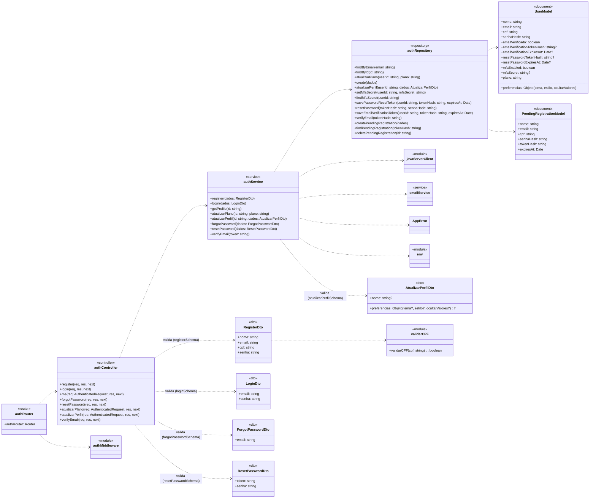
```mermaid
classDiagram
direction LR
class authRouter {
  <<router>>
  +authRouter: Router
}
class authController {
  <<controller>>
  +register(req, res, next)
  +login(req, res, next)
  +me(req: AuthenticatedRequest, res, next)
  +forgotPassword(req, res, next)
  +resetPassword(req, res, next)
  +atualizarPlano(req: AuthenticatedRequest, res, next)
  +atualizarPerfil(req: AuthenticatedRequest, res, next)
  +verifyEmail(req, res, next)
}
class authService {
  <<service>>
  +register(dados: RegisterDto)
  +login(dados: LoginDto)
  +getProfile(id: string)
  +atualizarPlano(id: string, plano: string)
  +atualizarPerfil(id: string, dados: AtualizarPerfilDto)
  +forgotPassword(dados: ForgotPasswordDto)
  +resetPassword(dados: ResetPasswordDto)
  +verifyEmail(token: string)
}
class authRepository {
  <<repository>>
  +findByEmail(email: string)
  +findById(id: string)
  +atualizarPlano(userId: string, plano: string)
  +create(dados)
  +atualizarPerfil(userId: string, dados: AtualizarPerfilDto)
  +setMfaSecret(userId: string, mfaSecret: string)
  +findMfaSecret(userId: string)
  +savePasswordResetToken(userId: string, tokenHash: string, expiresAt: Date)
  +resetPassword(tokenHash: string, senhaHash: string)
  +saveEmailVerificationToken(userId: string, tokenHash: string, expiresAt: Date)
  +verifyEmail(tokenHash: string)
  +createPendingRegistration(dados)
  +findPendingRegistration(tokenHash: string)
  +deletePendingRegistration(id: string)
}
class UserModel {
  <<document>>
  +nome: string
  +email: string
  +cpf: string
  +senhaHash: string
  +emailVerificado: boolean
  +emailVerificationTokenHash: string?
  +emailVerificationExpiresAt: Date?
  +resetPasswordTokenHash: string?
  +resetPasswordExpiresAt: Date?
  +mfaEnabled: boolean
  +mfaSecret: string?
  +plano: string
  +preferencias: Objeto(tema, estilo, ocultarValores)
}
class PendingRegistrationModel {
  <<document>>
  +nome: string
  +email: string
  +cpf: string
  +senhaHash: string
  +tokenHash: string
  +expiresAt: Date
}
class RegisterDto {
  <<dto>>
  +nome: string
  +email: string
  +cpf: string
  +senha: string
}
class LoginDto {
  <<dto>>
  +email: string
  +senha: string
}
class ForgotPasswordDto {
  <<dto>>
  +email: string
}
class ResetPasswordDto {
  <<dto>>
  +token: string
  +senha: string
}
class AtualizarPerfilDto {
  <<dto>>
  +nome: string?
  +preferencias: Objeto(tema?, estilo?, ocultarValores?)?
}
class validarCPF {
  <<module>>
  +validarCPF(cpf: string): boolean
}
class javaServerClient {
  <<module>>
}
class emailService {
  <<service>>
}
class authMiddleware {
  <<module>>
}
class AppError
class env {
  <<module>>
}
authRouter ..> authController
authRouter ..> authMiddleware
authController ..> authService
authController ..> RegisterDto : valida (registerSchema)
authController ..> LoginDto : valida (loginSchema)
authController ..> ForgotPasswordDto : valida (forgotPasswordSchema)
authController ..> ResetPasswordDto : valida (resetPasswordSchema)
authService ..> authRepository
authService ..> javaServerClient
authService ..> emailService
authService ..> AppError
authService ..> env
authService ..> AtualizarPerfilDto : valida (atualizarPerfilSchema)
authRepository ..> UserModel
authRepository ..> PendingRegistrationModel
RegisterDto ..> validarCPF
```

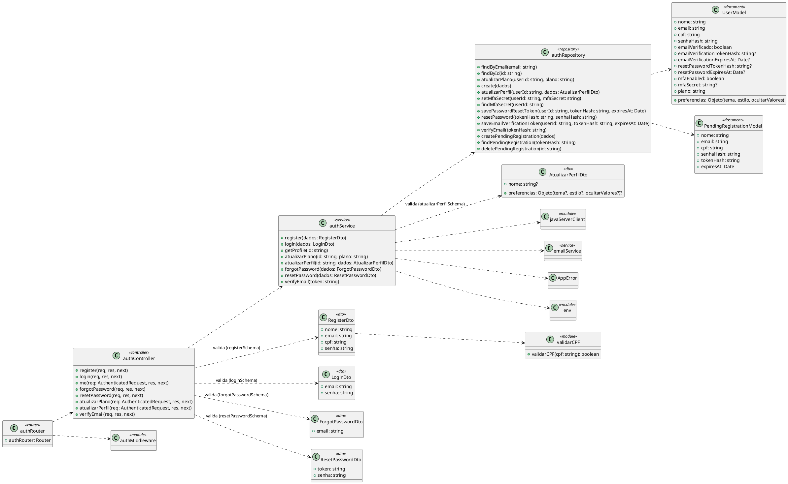
```plantuml
@startuml
left to right direction
class authRouter <<router>> {
  +authRouter: Router
}
class authController <<controller>> {
  +register(req, res, next)
  +login(req, res, next)
  +me(req: AuthenticatedRequest, res, next)
  +forgotPassword(req, res, next)
  +resetPassword(req, res, next)
  +atualizarPlano(req: AuthenticatedRequest, res, next)
  +atualizarPerfil(req: AuthenticatedRequest, res, next)
  +verifyEmail(req, res, next)
}
class authService <<service>> {
  +register(dados: RegisterDto)
  +login(dados: LoginDto)
  +getProfile(id: string)
  +atualizarPlano(id: string, plano: string)
  +atualizarPerfil(id: string, dados: AtualizarPerfilDto)
  +forgotPassword(dados: ForgotPasswordDto)
  +resetPassword(dados: ResetPasswordDto)
  +verifyEmail(token: string)
}
class authRepository <<repository>> {
  +findByEmail(email: string)
  +findById(id: string)
  +atualizarPlano(userId: string, plano: string)
  +create(dados)
  +atualizarPerfil(userId: string, dados: AtualizarPerfilDto)
  +setMfaSecret(userId: string, mfaSecret: string)
  +findMfaSecret(userId: string)
  +savePasswordResetToken(userId: string, tokenHash: string, expiresAt: Date)
  +resetPassword(tokenHash: string, senhaHash: string)
  +saveEmailVerificationToken(userId: string, tokenHash: string, expiresAt: Date)
  +verifyEmail(tokenHash: string)
  +createPendingRegistration(dados)
  +findPendingRegistration(tokenHash: string)
  +deletePendingRegistration(id: string)
}
class UserModel <<document>> {
  +nome: string
  +email: string
  +cpf: string
  +senhaHash: string
  +emailVerificado: boolean
  +emailVerificationTokenHash: string?
  +emailVerificationExpiresAt: Date?
  +resetPasswordTokenHash: string?
  +resetPasswordExpiresAt: Date?
  +mfaEnabled: boolean
  +mfaSecret: string?
  +plano: string
  +preferencias: Objeto(tema, estilo, ocultarValores)
}
class PendingRegistrationModel <<document>> {
  +nome: string
  +email: string
  +cpf: string
  +senhaHash: string
  +tokenHash: string
  +expiresAt: Date
}
class RegisterDto <<dto>> {
  +nome: string
  +email: string
  +cpf: string
  +senha: string
}
class LoginDto <<dto>> {
  +email: string
  +senha: string
}
class ForgotPasswordDto <<dto>> {
  +email: string
}
class ResetPasswordDto <<dto>> {
  +token: string
  +senha: string
}
class AtualizarPerfilDto <<dto>> {
  +nome: string?
  +preferencias: Objeto(tema?, estilo?, ocultarValores?)?
}
class validarCPF <<module>> {
  +validarCPF(cpf: string): boolean
}
class javaServerClient <<module>>
class emailService <<service>>
class authMiddleware <<module>>
class AppError
class env <<module>>
authRouter ..> authController
authRouter ..> authMiddleware
authController ..> authService
authController ..> RegisterDto : valida (registerSchema)
authController ..> LoginDto : valida (loginSchema)
authController ..> ForgotPasswordDto : valida (forgotPasswordSchema)
authController ..> ResetPasswordDto : valida (resetPasswordSchema)
authService ..> authRepository
authService ..> javaServerClient
authService ..> emailService
authService ..> AppError
authService ..> env
authService ..> AtualizarPerfilDto : valida (atualizarPerfilSchema)
authRepository ..> UserModel
authRepository ..> PendingRegistrationModel
RegisterDto ..> validarCPF
@enduml
```

---

## 5. Backend — Suporte

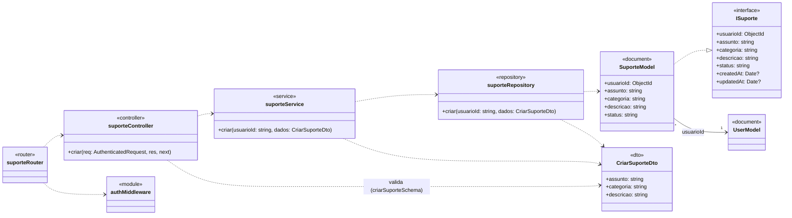
```mermaid
classDiagram
direction LR
class suporteRouter {
  <<router>>
}
class suporteController {
  <<controller>>
  +criar(req: AuthenticatedRequest, res, next)
}
class suporteService {
  <<service>>
  +criar(usuarioId: string, dados: CriarSuporteDto)
}
class suporteRepository {
  <<repository>>
  +criar(usuarioId: string, dados: CriarSuporteDto)
}
class ISuporte {
  <<interface>>
  +usuarioId: ObjectId
  +assunto: string
  +categoria: string
  +descricao: string
  +status: string
  +createdAt: Date?
  +updatedAt: Date?
}
class SuporteModel {
  <<document>>
  +usuarioId: ObjectId
  +assunto: string
  +categoria: string
  +descricao: string
  +status: string
}
class CriarSuporteDto {
  <<dto>>
  +assunto: string
  +categoria: string
  +descricao: string
}
class UserModel {
  <<document>>
}
class authMiddleware {
  <<module>>
}
suporteRouter ..> suporteController
suporteRouter ..> authMiddleware
suporteController ..> suporteService
suporteController ..> CriarSuporteDto : valida (criarSuporteSchema)
suporteService ..> suporteRepository
suporteService ..> CriarSuporteDto
suporteRepository ..> SuporteModel
suporteRepository ..> CriarSuporteDto
SuporteModel ..|> ISuporte
SuporteModel "*" --> "1" UserModel : usuarioId
```

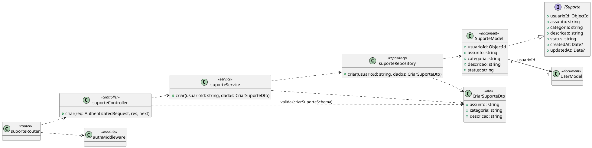
```plantuml
@startuml
left to right direction
class suporteRouter <<router>>
class suporteController <<controller>> {
  +criar(req: AuthenticatedRequest, res, next)
}
class suporteService <<service>> {
  +criar(usuarioId: string, dados: CriarSuporteDto)
}
class suporteRepository <<repository>> {
  +criar(usuarioId: string, dados: CriarSuporteDto)
}
interface ISuporte {
  +usuarioId: ObjectId
  +assunto: string
  +categoria: string
  +descricao: string
  +status: string
  +createdAt: Date?
  +updatedAt: Date?
}
class SuporteModel <<document>> {
  +usuarioId: ObjectId
  +assunto: string
  +categoria: string
  +descricao: string
  +status: string
}
class CriarSuporteDto <<dto>> {
  +assunto: string
  +categoria: string
  +descricao: string
}
class UserModel <<document>>
class authMiddleware <<module>>
suporteRouter ..> suporteController
suporteRouter ..> authMiddleware
suporteController ..> suporteService
suporteController ..> CriarSuporteDto : valida (criarSuporteSchema)
suporteService ..> suporteRepository
suporteService ..> CriarSuporteDto
suporteRepository ..> SuporteModel
suporteRepository ..> CriarSuporteDto
SuporteModel ..|> ISuporte
SuporteModel "*" --> "1" UserModel : usuarioId
@enduml
```

Valores de `categoria`: `erro-tecnico`, `conta-acesso`, `plano`, `outros`. Valores de `status`: `aberto`, `em_andamento`, `resolvido`.

---

## 6. Backend — Transações (camadas e regra)

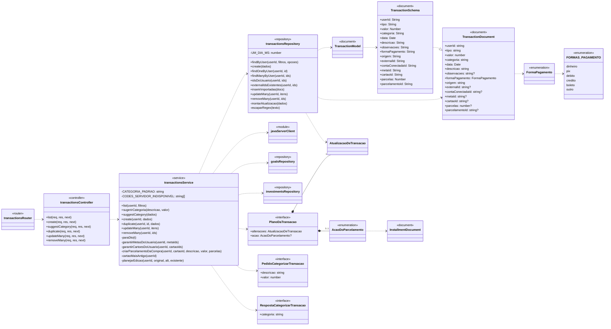
```mermaid
classDiagram
direction LR
class transactionsRouter {
  <<router>>
}
class transactionsController {
  <<controller>>
  +list(req, res, next)
  +create(req, res, next)
  +suggestCategory(req, res, next)
  +duplicate(req, res, next)
  +updateMany(req, res, next)
  +removeMany(req, res, next)
}
class transactionsService {
  <<service>>
  -CATEGORIA_PADRAO: string
  -CODES_SERVIDOR_INDISPONIVEL: string[]
  +list(userId, filtros)
  +sugerirCategoria(descricao, valor)
  +suggestCategory(dados)
  +create(userId, dados)
  +duplicate(userId, id, dados)
  +updateMany(userId, itens)
  +removeMany(userId, ids)
  -paraDto(t)
  -garantirMetasDoUsuario(userId, metaIds)
  -garantirCartoesDoUsuario(userId, cartaoIds)
  -criarParcelamentoDaCompra(userId, cartaoId, descricao, valor, parcelas)
  -cartaoMaisAntigo(userId)
  -planejarEdicao(userId, original, alt, existente)
}
class transactionsRepository {
  <<repository>>
  -UM_DIA_MS: number
  +findByUser(userId, filtros, opcoes)
  +create(dados)
  +findOneByUser(userId, id)
  +findManyByUser(userId, ids)
  +idsDoUsuario(userId, ids)
  +externalIdsExistentes(userId, ids)
  +inserirImportadas(docs)
  +updateMany(userId, itens)
  +removeMany(userId, ids)
  -montarAtualizacao(dados)
  -escaparRegex(texto)
}
class TransactionSchema {
  <<document>>
  +userId: String
  +tipo: String
  +valor: Number
  +categoria: String
  +data: Date
  +descricao: String
  +observacoes: String
  +formaPagamento: String
  +origem: String
  +externalId: String
  +contaConectadaId: String
  +metaId: String
  +cartaoId: String
  +parcelas: Number
  +parcelamentoId: String
}
class TransactionModel {
  <<document>>
}
class TransactionDocument {
  <<document>>
  +userId: string
  +tipo: string
  +valor: number
  +categoria: string
  +data: Date
  +descricao: string
  +observacoes: string?
  +formaPagamento: FormaPagamento
  +origem: string
  +externalId: string?
  +contaConectadaId: string?
  +metaId: string?
  +cartaoId: string?
  +parcelas: number?
  +parcelamentoId: string?
}
class FORMAS_PAGAMENTO {
  <<enumeration>>
  dinheiro
  pix
  debito
  credito
  boleto
  outro
}
class FormaPagamento {
  <<enumeration>>
}
class PlanoDaTransacao {
  <<interface>>
  +alteracoes: AtualizacaoDeTransacao
  +acao: AcaoDoParcelamento?
}
class AcaoDoParcelamento {
  <<enumeration>>
}
class AtualizacaoDeTransacao
class PedidoCategorizarTransacao {
  <<interface>>
  +descricao: string
  +valor: number
}
class RespostaCategorizarTransacao {
  <<interface>>
  +categoria: string
}
class javaServerClient {
  <<module>>
}
class goalsRepository {
  <<repository>>
}
class investmentsRepository {
  <<repository>>
}
class InstallmentDocument {
  <<document>>
}
transactionsRouter ..> transactionsController
transactionsController ..> transactionsService
transactionsService ..> transactionsRepository
transactionsService ..> javaServerClient
transactionsService ..> goalsRepository
transactionsService ..> investmentsRepository
transactionsService ..> PlanoDaTransacao
transactionsService ..> PedidoCategorizarTransacao
transactionsService ..> RespostaCategorizarTransacao
transactionsRepository ..> TransactionModel
transactionsRepository ..> TransactionDocument
transactionsRepository ..> AtualizacaoDeTransacao
TransactionModel ..> TransactionSchema
TransactionSchema ..|> TransactionDocument
TransactionDocument ..> FormaPagamento
FormaPagamento ..> FORMAS_PAGAMENTO
PlanoDaTransacao *-- "1" AtualizacaoDeTransacao
PlanoDaTransacao *-- "0..1" AcaoDoParcelamento
AcaoDoParcelamento ..> InstallmentDocument
```

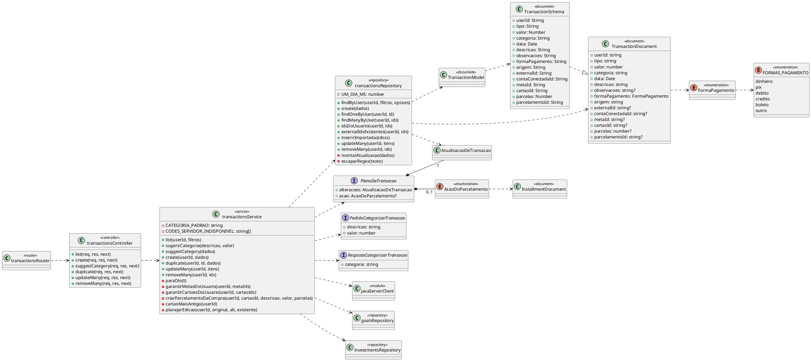
```plantuml
@startuml
left to right direction
class transactionsRouter <<router>>
class transactionsController <<controller>> {
  +list(req, res, next)
  +create(req, res, next)
  +suggestCategory(req, res, next)
  +duplicate(req, res, next)
  +updateMany(req, res, next)
  +removeMany(req, res, next)
}
class transactionsService <<service>> {
  -CATEGORIA_PADRAO: string
  -CODES_SERVIDOR_INDISPONIVEL: string[]
  +list(userId, filtros)
  +sugerirCategoria(descricao, valor)
  +suggestCategory(dados)
  +create(userId, dados)
  +duplicate(userId, id, dados)
  +updateMany(userId, itens)
  +removeMany(userId, ids)
  -paraDto(t)
  -garantirMetasDoUsuario(userId, metaIds)
  -garantirCartoesDoUsuario(userId, cartaoIds)
  -criarParcelamentoDaCompra(userId, cartaoId, descricao, valor, parcelas)
  -cartaoMaisAntigo(userId)
  -planejarEdicao(userId, original, alt, existente)
}
class transactionsRepository <<repository>> {
  -UM_DIA_MS: number
  +findByUser(userId, filtros, opcoes)
  +create(dados)
  +findOneByUser(userId, id)
  +findManyByUser(userId, ids)
  +idsDoUsuario(userId, ids)
  +externalIdsExistentes(userId, ids)
  +inserirImportadas(docs)
  +updateMany(userId, itens)
  +removeMany(userId, ids)
  -montarAtualizacao(dados)
  -escaparRegex(texto)
}
class TransactionSchema <<document>> {
  +userId: String
  +tipo: String
  +valor: Number
  +categoria: String
  +data: Date
  +descricao: String
  +observacoes: String
  +formaPagamento: String
  +origem: String
  +externalId: String
  +contaConectadaId: String
  +metaId: String
  +cartaoId: String
  +parcelas: Number
  +parcelamentoId: String
}
class TransactionModel <<document>>
class TransactionDocument <<document>> {
  +userId: string
  +tipo: string
  +valor: number
  +categoria: string
  +data: Date
  +descricao: string
  +observacoes: string?
  +formaPagamento: FormaPagamento
  +origem: string
  +externalId: string?
  +contaConectadaId: string?
  +metaId: string?
  +cartaoId: string?
  +parcelas: number?
  +parcelamentoId: string?
}
enum FORMAS_PAGAMENTO <<enumeration>> {
  dinheiro
  pix
  debito
  credito
  boleto
  outro
}
enum FormaPagamento <<enumeration>>
interface PlanoDaTransacao {
  +alteracoes: AtualizacaoDeTransacao
  +acao: AcaoDoParcelamento?
}
enum AcaoDoParcelamento <<enumeration>>
class AtualizacaoDeTransacao
interface PedidoCategorizarTransacao {
  +descricao: string
  +valor: number
}
interface RespostaCategorizarTransacao {
  +categoria: string
}
class javaServerClient <<module>>
class goalsRepository <<repository>>
class investmentsRepository <<repository>>
class InstallmentDocument <<document>>
transactionsRouter ..> transactionsController
transactionsController ..> transactionsService
transactionsService ..> transactionsRepository
transactionsService ..> javaServerClient
transactionsService ..> goalsRepository
transactionsService ..> investmentsRepository
transactionsService ..> PlanoDaTransacao
transactionsService ..> PedidoCategorizarTransacao
transactionsService ..> RespostaCategorizarTransacao
transactionsRepository ..> TransactionModel
transactionsRepository ..> TransactionDocument
transactionsRepository ..> AtualizacaoDeTransacao
TransactionModel ..> TransactionSchema
TransactionSchema ..|> TransactionDocument
TransactionDocument ..> FormaPagamento
FormaPagamento ..> FORMAS_PAGAMENTO
PlanoDaTransacao *-- "1" AtualizacaoDeTransacao
PlanoDaTransacao *-- "0..1" AcaoDoParcelamento
AcaoDoParcelamento ..> InstallmentDocument
@enduml
```

Valores de `tipo`: `receita`, `despesa`. Valores de `origem`: `manual`, `pluggy`.

---

## 7. Backend — Transações (DTOs e validação)

Schemas zod citados em nota: `createTransactionSchema`, `transactionFiltersSchema`, `updateTransactionSchema`, `transactionIdSchema`, `suggestCategorySchema`, `duplicateTransactionSchema`, `bulkUpdateSchema`, `bulkDeleteSchema`. Cada `XxxDto` é o tipo inferido do schema correspondente.

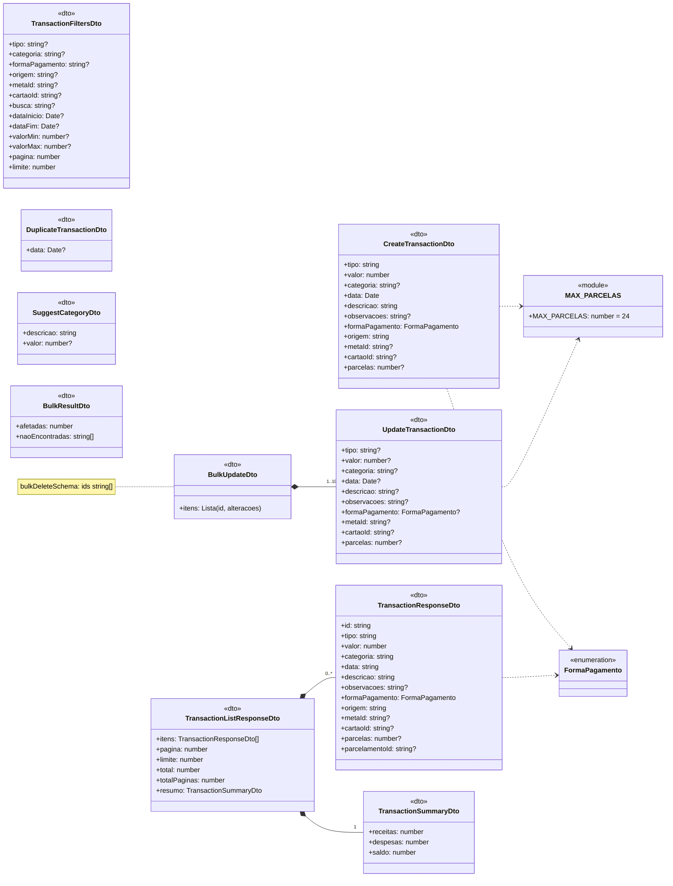
```mermaid
classDiagram
direction LR
class CreateTransactionDto {
  <<dto>>
  +tipo: string
  +valor: number
  +categoria: string?
  +data: Date
  +descricao: string
  +observacoes: string?
  +formaPagamento: FormaPagamento
  +origem: string
  +metaId: string?
  +cartaoId: string?
  +parcelas: number?
}
class UpdateTransactionDto {
  <<dto>>
  +tipo: string?
  +valor: number?
  +categoria: string?
  +data: Date?
  +descricao: string?
  +observacoes: string?
  +formaPagamento: FormaPagamento?
  +metaId: string?
  +cartaoId: string?
  +parcelas: number?
}
class TransactionFiltersDto {
  <<dto>>
  +tipo: string?
  +categoria: string?
  +formaPagamento: string?
  +origem: string?
  +metaId: string?
  +cartaoId: string?
  +busca: string?
  +dataInicio: Date?
  +dataFim: Date?
  +valorMin: number?
  +valorMax: number?
  +pagina: number
  +limite: number
}
class BulkUpdateDto {
  <<dto>>
  +itens: Lista(id, alteracoes)
}
class DuplicateTransactionDto {
  <<dto>>
  +data: Date?
}
class SuggestCategoryDto {
  <<dto>>
  +descricao: string
  +valor: number?
}
class TransactionResponseDto {
  <<dto>>
  +id: string
  +tipo: string
  +valor: number
  +categoria: string
  +data: string
  +descricao: string
  +observacoes: string?
  +formaPagamento: FormaPagamento
  +origem: string
  +metaId: string?
  +cartaoId: string?
  +parcelas: number?
  +parcelamentoId: string?
}
class TransactionListResponseDto {
  <<dto>>
  +itens: TransactionResponseDto[]
  +pagina: number
  +limite: number
  +total: number
  +totalPaginas: number
  +resumo: TransactionSummaryDto
}
class TransactionSummaryDto {
  <<dto>>
  +receitas: number
  +despesas: number
  +saldo: number
}
class BulkResultDto {
  <<dto>>
  +afetadas: number
  +naoEncontradas: string[]
}
class MAX_PARCELAS {
  <<module>>
  +MAX_PARCELAS: number = 24
}
class FormaPagamento {
  <<enumeration>>
}
CreateTransactionDto ..> MAX_PARCELAS
UpdateTransactionDto ..> MAX_PARCELAS
CreateTransactionDto ..> FormaPagamento
TransactionResponseDto ..> FormaPagamento
BulkUpdateDto *-- "1..100" UpdateTransactionDto
TransactionListResponseDto *-- "0..*" TransactionResponseDto
TransactionListResponseDto *-- "1" TransactionSummaryDto
note for BulkUpdateDto "bulkDeleteSchema: ids string[]"
```

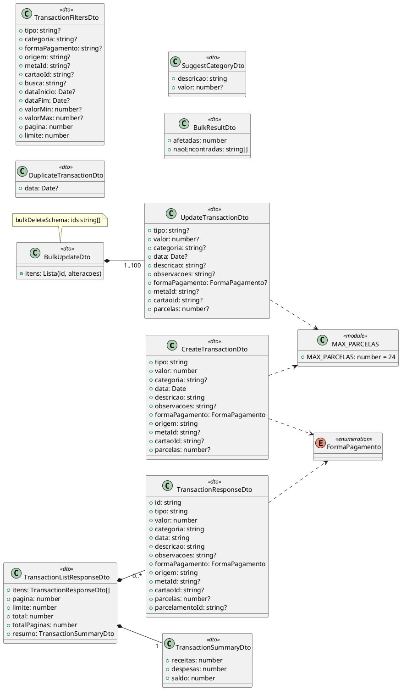
```plantuml
@startuml
left to right direction
class CreateTransactionDto <<dto>> {
  +tipo: string
  +valor: number
  +categoria: string?
  +data: Date
  +descricao: string
  +observacoes: string?
  +formaPagamento: FormaPagamento
  +origem: string
  +metaId: string?
  +cartaoId: string?
  +parcelas: number?
}
class UpdateTransactionDto <<dto>> {
  +tipo: string?
  +valor: number?
  +categoria: string?
  +data: Date?
  +descricao: string?
  +observacoes: string?
  +formaPagamento: FormaPagamento?
  +metaId: string?
  +cartaoId: string?
  +parcelas: number?
}
class TransactionFiltersDto <<dto>> {
  +tipo: string?
  +categoria: string?
  +formaPagamento: string?
  +origem: string?
  +metaId: string?
  +cartaoId: string?
  +busca: string?
  +dataInicio: Date?
  +dataFim: Date?
  +valorMin: number?
  +valorMax: number?
  +pagina: number
  +limite: number
}
class BulkUpdateDto <<dto>> {
  +itens: Lista(id, alteracoes)
}
class DuplicateTransactionDto <<dto>> {
  +data: Date?
}
class SuggestCategoryDto <<dto>> {
  +descricao: string
  +valor: number?
}
class TransactionResponseDto <<dto>> {
  +id: string
  +tipo: string
  +valor: number
  +categoria: string
  +data: string
  +descricao: string
  +observacoes: string?
  +formaPagamento: FormaPagamento
  +origem: string
  +metaId: string?
  +cartaoId: string?
  +parcelas: number?
  +parcelamentoId: string?
}
class TransactionListResponseDto <<dto>> {
  +itens: TransactionResponseDto[]
  +pagina: number
  +limite: number
  +total: number
  +totalPaginas: number
  +resumo: TransactionSummaryDto
}
class TransactionSummaryDto <<dto>> {
  +receitas: number
  +despesas: number
  +saldo: number
}
class BulkResultDto <<dto>> {
  +afetadas: number
  +naoEncontradas: string[]
}
class MAX_PARCELAS <<module>> {
  +MAX_PARCELAS: number = 24
}
enum FormaPagamento <<enumeration>>
CreateTransactionDto ..> MAX_PARCELAS
UpdateTransactionDto ..> MAX_PARCELAS
CreateTransactionDto ..> FormaPagamento
TransactionResponseDto ..> FormaPagamento
BulkUpdateDto *-- "1..100" UpdateTransactionDto
TransactionListResponseDto *-- "0..*" TransactionResponseDto
TransactionListResponseDto *-- "1" TransactionSummaryDto
note top of BulkUpdateDto : bulkDeleteSchema: ids string[]
@enduml
```

---

## 8. Backend — Contas conectadas (Pluggy)

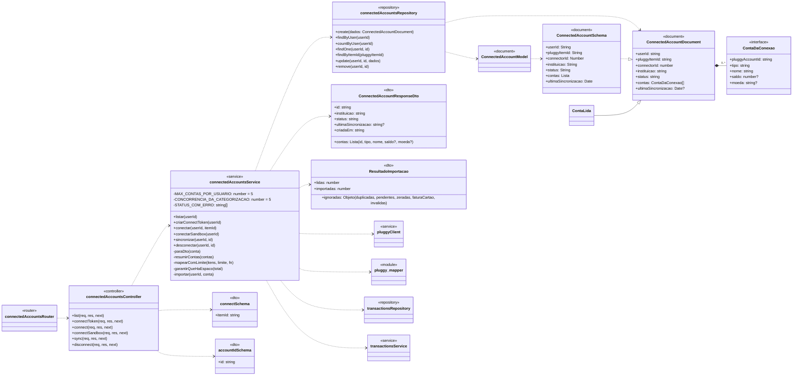
```mermaid
classDiagram
direction LR
class connectedAccountsRouter {
  <<router>>
}
class connectedAccountsController {
  <<controller>>
  +list(req, res, next)
  +connectToken(req, res, next)
  +connect(req, res, next)
  +connectSandbox(req, res, next)
  +sync(req, res, next)
  +disconnect(req, res, next)
}
class connectedAccountsService {
  <<service>>
  -MAX_CONTAS_POR_USUARIO: number = 5
  -CONCORRENCIA_DA_CATEGORIZACAO: number = 5
  -STATUS_COM_ERRO: string[]
  +listar(userId)
  +criarConnectToken(userId)
  +conectar(userId, itemId)
  +conectarSandbox(userId)
  +sincronizar(userId, id)
  +desconectar(userId, id)
  -paraDto(conta)
  -resumirContas(contas)
  -mapearComLimite(itens, limite, fn)
  -garantirQueHaEspaco(total)
  -importar(userId, conta)
}
class connectedAccountsRepository {
  <<repository>>
  +create(dados: ConnectedAccountDocument)
  +findByUser(userId)
  +countByUser(userId)
  +findOne(userId, id)
  +findByItemId(pluggyItemId)
  +update(userId, id, dados)
  +remove(userId, id)
}
class ConnectedAccountSchema {
  <<document>>
  +userId: String
  +pluggyItemId: String
  +connectorId: Number
  +instituicao: String
  +status: String
  +contas: Lista
  +ultimaSincronizacao: Date
}
class ConnectedAccountModel {
  <<document>>
}
class ConnectedAccountDocument {
  <<document>>
  +userId: string
  +pluggyItemId: string
  +connectorId: number
  +instituicao: string
  +status: string
  +contas: ContaDaConexao[]
  +ultimaSincronizacao: Date?
}
class ContaDaConexao {
  <<interface>>
  +pluggyAccountId: string
  +tipo: string
  +nome: string
  +saldo: number?
  +moeda: string?
}
class ContaLida
class connectSchema {
  <<dto>>
  +itemId: string
}
class accountIdSchema {
  <<dto>>
  +id: string
}
class ConnectedAccountResponseDto {
  <<dto>>
  +id: string
  +instituicao: string
  +status: string
  +contas: Lista(id, tipo, nome, saldo?, moeda?)
  +ultimaSincronizacao: string?
  +criadaEm: string
}
class ResultadoImportacao {
  <<dto>>
  +lidas: number
  +importadas: number
  +ignoradas: Objeto(duplicadas, pendentes, zeradas, faturaCartao, invalidas)
}
class pluggyClient {
  <<service>>
}
class pluggy_mapper {
  <<module>>
}
class transactionsRepository {
  <<repository>>
}
class transactionsService {
  <<service>>
}
connectedAccountsRouter ..> connectedAccountsController
connectedAccountsController ..> connectedAccountsService
connectedAccountsController ..> connectSchema
connectedAccountsController ..> accountIdSchema
connectedAccountsService ..> connectedAccountsRepository
connectedAccountsService ..> transactionsRepository
connectedAccountsService ..> transactionsService
connectedAccountsService ..> pluggyClient
connectedAccountsService ..> pluggy_mapper
connectedAccountsService ..> ConnectedAccountResponseDto
connectedAccountsService ..> ResultadoImportacao
connectedAccountsRepository ..> ConnectedAccountModel
connectedAccountsRepository ..> ConnectedAccountDocument
ConnectedAccountModel ..> ConnectedAccountSchema
ConnectedAccountSchema ..|> ConnectedAccountDocument
ConnectedAccountDocument *-- "0..*" ContaDaConexao
ContaLida --|> ConnectedAccountDocument
```

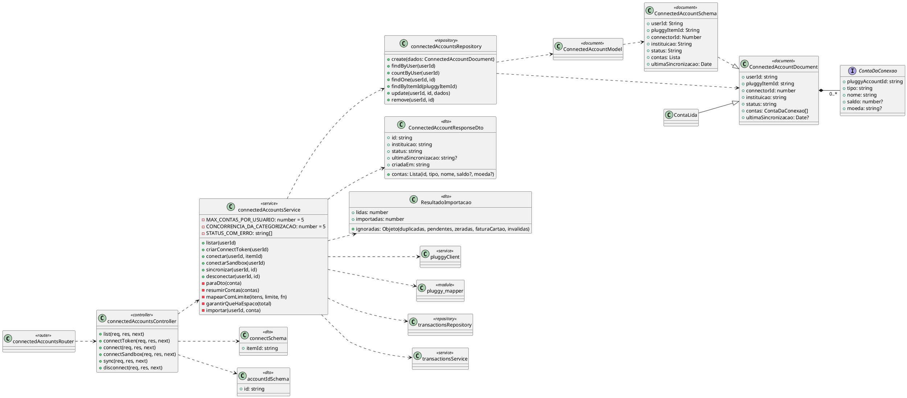
```plantuml
@startuml
left to right direction
class connectedAccountsRouter <<router>>
class connectedAccountsController <<controller>> {
  +list(req, res, next)
  +connectToken(req, res, next)
  +connect(req, res, next)
  +connectSandbox(req, res, next)
  +sync(req, res, next)
  +disconnect(req, res, next)
}
class connectedAccountsService <<service>> {
  -MAX_CONTAS_POR_USUARIO: number = 5
  -CONCORRENCIA_DA_CATEGORIZACAO: number = 5
  -STATUS_COM_ERRO: string[]
  +listar(userId)
  +criarConnectToken(userId)
  +conectar(userId, itemId)
  +conectarSandbox(userId)
  +sincronizar(userId, id)
  +desconectar(userId, id)
  -paraDto(conta)
  -resumirContas(contas)
  -mapearComLimite(itens, limite, fn)
  -garantirQueHaEspaco(total)
  -importar(userId, conta)
}
class connectedAccountsRepository <<repository>> {
  +create(dados: ConnectedAccountDocument)
  +findByUser(userId)
  +countByUser(userId)
  +findOne(userId, id)
  +findByItemId(pluggyItemId)
  +update(userId, id, dados)
  +remove(userId, id)
}
class ConnectedAccountSchema <<document>> {
  +userId: String
  +pluggyItemId: String
  +connectorId: Number
  +instituicao: String
  +status: String
  +contas: Lista
  +ultimaSincronizacao: Date
}
class ConnectedAccountModel <<document>>
class ConnectedAccountDocument <<document>> {
  +userId: string
  +pluggyItemId: string
  +connectorId: number
  +instituicao: string
  +status: string
  +contas: ContaDaConexao[]
  +ultimaSincronizacao: Date?
}
interface ContaDaConexao {
  +pluggyAccountId: string
  +tipo: string
  +nome: string
  +saldo: number?
  +moeda: string?
}
class ContaLida
class connectSchema <<dto>> {
  +itemId: string
}
class accountIdSchema <<dto>> {
  +id: string
}
class ConnectedAccountResponseDto <<dto>> {
  +id: string
  +instituicao: string
  +status: string
  +contas: Lista(id, tipo, nome, saldo?, moeda?)
  +ultimaSincronizacao: string?
  +criadaEm: string
}
class ResultadoImportacao <<dto>> {
  +lidas: number
  +importadas: number
  +ignoradas: Objeto(duplicadas, pendentes, zeradas, faturaCartao, invalidas)
}
class pluggyClient <<service>>
class pluggy_mapper <<module>>
class transactionsRepository <<repository>>
class transactionsService <<service>>
connectedAccountsRouter ..> connectedAccountsController
connectedAccountsController ..> connectedAccountsService
connectedAccountsController ..> connectSchema
connectedAccountsController ..> accountIdSchema
connectedAccountsService ..> connectedAccountsRepository
connectedAccountsService ..> transactionsRepository
connectedAccountsService ..> transactionsService
connectedAccountsService ..> pluggyClient
connectedAccountsService ..> pluggy_mapper
connectedAccountsService ..> ConnectedAccountResponseDto
connectedAccountsService ..> ResultadoImportacao
connectedAccountsRepository ..> ConnectedAccountModel
connectedAccountsRepository ..> ConnectedAccountDocument
ConnectedAccountModel ..> ConnectedAccountSchema
ConnectedAccountSchema ..|> ConnectedAccountDocument
ConnectedAccountDocument *-- "0..*" ContaDaConexao
ContaLida --|> ConnectedAccountDocument
@enduml
```

---

## 9. Backend — Painel

O `dashboardRepository` lê a coleção `transactions`; não há Model próprio do painel.

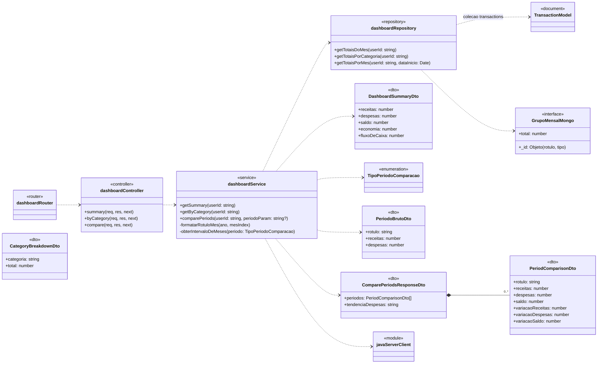
```mermaid
classDiagram
direction LR
class dashboardRouter {
  <<router>>
}
class dashboardController {
  <<controller>>
  +summary(req, res, next)
  +byCategory(req, res, next)
  +compare(req, res, next)
}
class dashboardService {
  <<service>>
  +getSummary(userId: string)
  +getByCategory(userId: string)
  +comparePeriods(userId: string, periodoParam: string?)
  -formatarRotuloMes(ano, mesIndex)
  -obterIntervaloDeMeses(periodo: TipoPeriodoComparacao)
}
class dashboardRepository {
  <<repository>>
  +getTotaisDoMes(userId: string)
  +getTotaisPorCategoria(userId: string)
  +getTotaisPorMes(userId: string, dataInicio: Date)
}
class DashboardSummaryDto {
  <<dto>>
  +receitas: number
  +despesas: number
  +saldo: number
  +economia: number
  +fluxoDeCaixa: number
}
class CategoryBreakdownDto {
  <<dto>>
  +categoria: string
  +total: number
}
class PeriodComparisonDto {
  <<dto>>
  +rotulo: string
  +receitas: number
  +despesas: number
  +saldo: number
  +variacaoReceitas: number
  +variacaoDespesas: number
  +variacaoSaldo: number
}
class TipoPeriodoComparacao {
  <<enumeration>>
}
class PeriodoBrutoDto {
  <<dto>>
  +rotulo: string
  +receitas: number
  +despesas: number
}
class ComparePeriodsResponseDto {
  <<dto>>
  +periodos: PeriodComparisonDto[]
  +tendenciaDespesas: string
}
class GrupoMensalMongo {
  <<interface>>
  +_id: Objeto(rotulo, tipo)
  +total: number
}
class TransactionModel {
  <<document>>
}
class javaServerClient {
  <<module>>
}
dashboardRouter ..> dashboardController
dashboardController ..> dashboardService
dashboardService ..> dashboardRepository
dashboardService ..> javaServerClient
dashboardService ..> DashboardSummaryDto
dashboardService ..> ComparePeriodsResponseDto
dashboardService ..> PeriodoBrutoDto
dashboardService ..> TipoPeriodoComparacao
dashboardRepository ..> TransactionModel : colecao transactions
dashboardRepository ..> GrupoMensalMongo
ComparePeriodsResponseDto *-- "0..*" PeriodComparisonDto
```

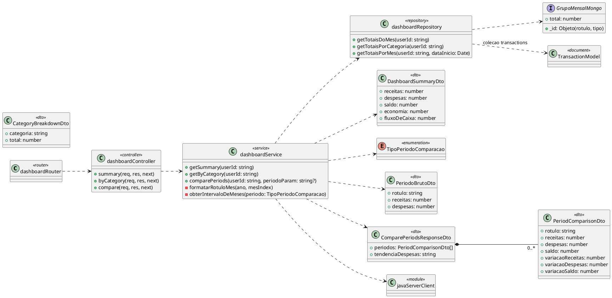
```plantuml
@startuml
left to right direction
class dashboardRouter <<router>>
class dashboardController <<controller>> {
  +summary(req, res, next)
  +byCategory(req, res, next)
  +compare(req, res, next)
}
class dashboardService <<service>> {
  +getSummary(userId: string)
  +getByCategory(userId: string)
  +comparePeriods(userId: string, periodoParam: string?)
  -formatarRotuloMes(ano, mesIndex)
  -obterIntervaloDeMeses(periodo: TipoPeriodoComparacao)
}
class dashboardRepository <<repository>> {
  +getTotaisDoMes(userId: string)
  +getTotaisPorCategoria(userId: string)
  +getTotaisPorMes(userId: string, dataInicio: Date)
}
class DashboardSummaryDto <<dto>> {
  +receitas: number
  +despesas: number
  +saldo: number
  +economia: number
  +fluxoDeCaixa: number
}
class CategoryBreakdownDto <<dto>> {
  +categoria: string
  +total: number
}
class PeriodComparisonDto <<dto>> {
  +rotulo: string
  +receitas: number
  +despesas: number
  +saldo: number
  +variacaoReceitas: number
  +variacaoDespesas: number
  +variacaoSaldo: number
}
enum TipoPeriodoComparacao <<enumeration>>
class PeriodoBrutoDto <<dto>> {
  +rotulo: string
  +receitas: number
  +despesas: number
}
class ComparePeriodsResponseDto <<dto>> {
  +periodos: PeriodComparisonDto[]
  +tendenciaDespesas: string
}
interface GrupoMensalMongo {
  +_id: Objeto(rotulo, tipo)
  +total: number
}
class TransactionModel <<document>>
class javaServerClient <<module>>
dashboardRouter ..> dashboardController
dashboardController ..> dashboardService
dashboardService ..> dashboardRepository
dashboardService ..> javaServerClient
dashboardService ..> DashboardSummaryDto
dashboardService ..> ComparePeriodsResponseDto
dashboardService ..> PeriodoBrutoDto
dashboardService ..> TipoPeriodoComparacao
dashboardRepository ..> TransactionModel : colecao transactions
dashboardRepository ..> GrupoMensalMongo
ComparePeriodsResponseDto *-- "0..*" PeriodComparisonDto
@enduml
```

`tendenciaDespesas` assume `alta`, `queda` ou `estavel`.

---

## 10. Backend — Metas

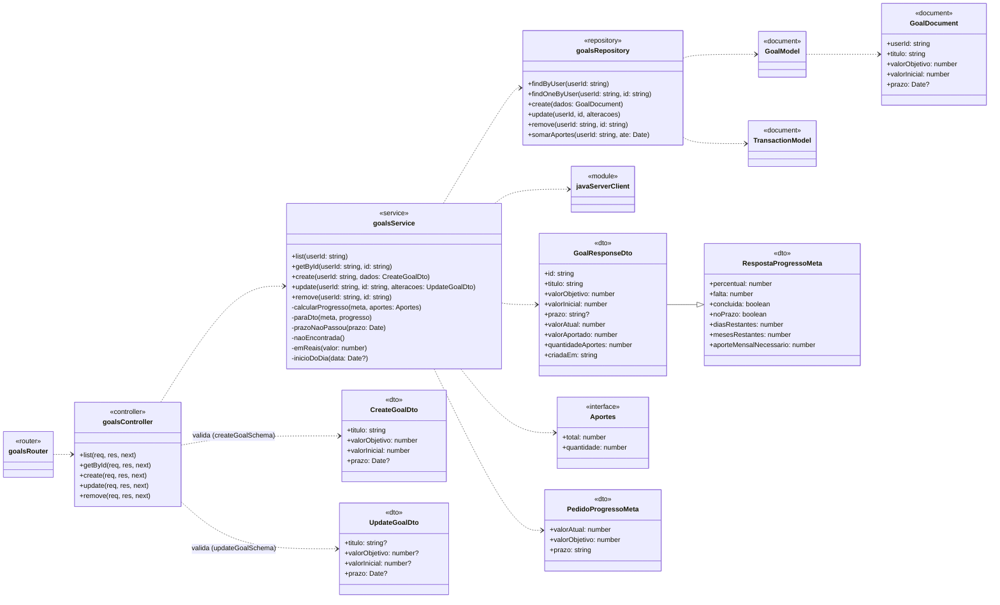
```mermaid
classDiagram
direction LR
class goalsRouter {
  <<router>>
}
class goalsController {
  <<controller>>
  +list(req, res, next)
  +getById(req, res, next)
  +create(req, res, next)
  +update(req, res, next)
  +remove(req, res, next)
}
class goalsService {
  <<service>>
  +list(userId: string)
  +getById(userId: string, id: string)
  +create(userId: string, dados: CreateGoalDto)
  +update(userId: string, id: string, alteracoes: UpdateGoalDto)
  +remove(userId: string, id: string)
  -calcularProgresso(meta, aportes: Aportes)
  -paraDto(meta, progresso)
  -prazoNaoPassou(prazo: Date)
  -naoEncontrada()
  -emReais(valor: number)
  -inicioDoDia(data: Date?)
}
class goalsRepository {
  <<repository>>
  +findByUser(userId: string)
  +findOneByUser(userId: string, id: string)
  +create(dados: GoalDocument)
  +update(userId, id, alteracoes)
  +remove(userId: string, id: string)
  +somarAportes(userId: string, ate: Date)
}
class GoalDocument {
  <<document>>
  +userId: string
  +titulo: string
  +valorObjetivo: number
  +valorInicial: number
  +prazo: Date?
}
class GoalModel {
  <<document>>
}
class Aportes {
  <<interface>>
  +total: number
  +quantidade: number
}
class CreateGoalDto {
  <<dto>>
  +titulo: string
  +valorObjetivo: number
  +valorInicial: number
  +prazo: Date?
}
class UpdateGoalDto {
  <<dto>>
  +titulo: string?
  +valorObjetivo: number?
  +valorInicial: number?
  +prazo: Date?
}
class PedidoProgressoMeta {
  <<dto>>
  +valorAtual: number
  +valorObjetivo: number
  +prazo: string
}
class RespostaProgressoMeta {
  <<dto>>
  +percentual: number
  +falta: number
  +concluida: boolean
  +noPrazo: boolean
  +diasRestantes: number
  +mesesRestantes: number
  +aporteMensalNecessario: number
}
class GoalResponseDto {
  <<dto>>
  +id: string
  +titulo: string
  +valorObjetivo: number
  +valorInicial: number
  +prazo: string?
  +valorAtual: number
  +valorAportado: number
  +quantidadeAportes: number
  +criadaEm: string
}
class TransactionModel {
  <<document>>
}
class javaServerClient {
  <<module>>
}
goalsRouter ..> goalsController
goalsController ..> goalsService
goalsController ..> CreateGoalDto : valida (createGoalSchema)
goalsController ..> UpdateGoalDto : valida (updateGoalSchema)
goalsService ..> goalsRepository
goalsService ..> javaServerClient
goalsService ..> GoalResponseDto
goalsService ..> Aportes
goalsRepository ..> GoalModel
goalsRepository ..> TransactionModel
GoalModel ..> GoalDocument
GoalResponseDto --|> RespostaProgressoMeta
goalsService ..> PedidoProgressoMeta
```

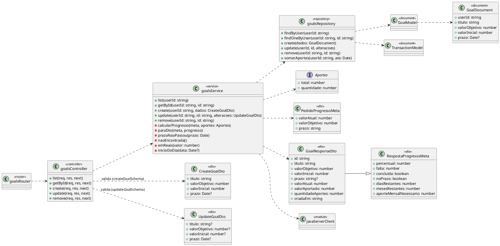
```plantuml
@startuml
left to right direction
class goalsRouter <<router>>
class goalsController <<controller>> {
  +list(req, res, next)
  +getById(req, res, next)
  +create(req, res, next)
  +update(req, res, next)
  +remove(req, res, next)
}
class goalsService <<service>> {
  +list(userId: string)
  +getById(userId: string, id: string)
  +create(userId: string, dados: CreateGoalDto)
  +update(userId: string, id: string, alteracoes: UpdateGoalDto)
  +remove(userId: string, id: string)
  -calcularProgresso(meta, aportes: Aportes)
  -paraDto(meta, progresso)
  -prazoNaoPassou(prazo: Date)
  -naoEncontrada()
  -emReais(valor: number)
  -inicioDoDia(data: Date?)
}
class goalsRepository <<repository>> {
  +findByUser(userId: string)
  +findOneByUser(userId: string, id: string)
  +create(dados: GoalDocument)
  +update(userId, id, alteracoes)
  +remove(userId: string, id: string)
  +somarAportes(userId: string, ate: Date)
}
class GoalDocument <<document>> {
  +userId: string
  +titulo: string
  +valorObjetivo: number
  +valorInicial: number
  +prazo: Date?
}
class GoalModel <<document>>
interface Aportes {
  +total: number
  +quantidade: number
}
class CreateGoalDto <<dto>> {
  +titulo: string
  +valorObjetivo: number
  +valorInicial: number
  +prazo: Date?
}
class UpdateGoalDto <<dto>> {
  +titulo: string?
  +valorObjetivo: number?
  +valorInicial: number?
  +prazo: Date?
}
class PedidoProgressoMeta <<dto>> {
  +valorAtual: number
  +valorObjetivo: number
  +prazo: string
}
class RespostaProgressoMeta <<dto>> {
  +percentual: number
  +falta: number
  +concluida: boolean
  +noPrazo: boolean
  +diasRestantes: number
  +mesesRestantes: number
  +aporteMensalNecessario: number
}
class GoalResponseDto <<dto>> {
  +id: string
  +titulo: string
  +valorObjetivo: number
  +valorInicial: number
  +prazo: string?
  +valorAtual: number
  +valorAportado: number
  +quantidadeAportes: number
  +criadaEm: string
}
class TransactionModel <<document>>
class javaServerClient <<module>>
goalsRouter ..> goalsController
goalsController ..> goalsService
goalsController ..> CreateGoalDto : valida (createGoalSchema)
goalsController ..> UpdateGoalDto : valida (updateGoalSchema)
goalsService ..> goalsRepository
goalsService ..> javaServerClient
goalsService ..> GoalResponseDto
goalsService ..> Aportes
goalsRepository ..> GoalModel
goalsRepository ..> TransactionModel
GoalModel ..> GoalDocument
GoalResponseDto --|> RespostaProgressoMeta
goalsService ..> PedidoProgressoMeta
@enduml
```

---

## 11. Backend — Cartões e parcelamentos

DTOs de entrada em nota: `createCardSchema` (nome, limite, diaFechamento 1..28), `updateCardSchema`, `createInstallmentSchema` (cartaoId?, descricao, valorTotal, parcelas, parcelasPagas, taxaJurosMensal), `updateInstallmentSchema` (descricao?, parcelasPagas?), `listInstallmentsQuerySchema` (cartaoId?). Os tipos `CreateCardDto`, `UpdateCardDto`, `CreateInstallmentDto` e `UpdateInstallmentDto` derivam deles.

```mermaid
classDiagram
direction LR
class investmentsRouter {
  <<router>>
}
class investmentsController {
  <<controller>>
  +listCards
  +getCardById
  +createCard
  +updateCardById
  +removeCardById
  +getCard
  +updateCard
  +listInstallments
  +createInstallment
  +updateInstallment
  +removeInstallment
}
class investmentsService {
  <<service>>
  +listCards(userId)
  +getCardById(userId, id)
  +createCard(userId, dados: CreateCardDto)
  +updateCardById(userId, id, alteracoes: UpdateCardDto)
  +removeCardById(userId, id)
  +listInstallments(userId, cartaoId)
  +createInstallment(userId, dados: CreateInstallmentDto)
  +updateInstallment(userId, id, alteracoes: UpdateInstallmentDto)
  +removeInstallment(userId, id)
  -mesesCompletos(desde: Date, ate: Date)
  -proximoFechamento(diaFechamento: number, hoje: Date)
  -vencimentoDoFechamento(fechamento: Date)
  -calcularParcelamentos(itens, contexto)
  -contextoDeParcelamentos(userId, ids)
  -parcelasPagasPelaData(item, datas, agora)
  -carregarCartoes(userId)
  -montarCartoes(userId, apenasId)
}
class investmentsRepository {
  <<repository>>
  +findCards(userId)
  +findCard(userId, id)
  +countCards(userId)
  +findCardByName(userId, nome, exceto)
  +ensureDefaultCard(userId)
  +findOldestCard(userId)
  +createCard(dados)
  +updateCard(userId, id, alteracoes)
  +countActiveInstallments(userId, cartaoId, ehPadrao)
  +removeCard(userId, cartaoId, ehPadrao)
  +somarComprasNoCredito(userId, de: Date, ate: Date)
  +findInstallments(userId)
  +findInstallment(userId, id)
  +findInstallmentsByIds(userId, ids)
  +createInstallment(dados: InstallmentDocument)
  +updateInstallment(userId, id, alteracoes)
  +removeInstallment(userId, id)
  +removeInstallments(userId, ids)
  +transacoesDosParcelamentos(userId, ids)
  +datasDasCompras(userId, ids)
  +migrarCartoes()
  -doCartao(cartaoId, ehPadrao)
}
class CardDocument {
  <<document>>
  +userId: string
  +nome: string
  +nomeChave: string
  +limite: number
  +diaFechamento: number
}
class InstallmentDocument {
  <<document>>
  +userId: string
  +cartaoId: string?
  +descricao: string
  +valorTotal: number
  +parcelas: number
  +parcelasPagas: number
  +taxaJurosMensal: number
}
class CardModel {
  <<document>>
}
class CardInstallmentModel {
  <<document>>
}
class CARTAO_PADRAO {
  <<module>>
  limite: 5000
  diaFechamento: 3
}
class ConstantesDeCartao {
  <<module>>
  MAX_CARTOES: 5
  NOME_CARTAO_PADRAO: Cartão
  DIAS_DO_FECHAMENTO_AO_VENCIMENTO: 7
  +chaveDoNome(nome: string): string
}
class ComprasDoCartao {
  <<interface>>
  +cartaoId: string?
  +total: number
}
class ContextoParcelamentos {
  <<interface>>
  +padraoId: string
  +transacoes: Map
  +datas: Map
}
class ParcelamentoParaCalculo {
  <<dto>>
  +id: string
  +descricao: string
  +valorTotal: number
  +parcelas: number
  +parcelasPagas: number
  +taxaJurosMensal: number
}
class ParcelamentoCalculado {
  <<dto>>
  +valorParcela: number
  +parcelasRestantes: number
  +saldoDevedor: number
  +jurosTotal: number
  +quitado: boolean
}
class PedidoCalcularParcelamentos {
  <<dto>>
  +parcelamentos: ParcelamentoParaCalculo[]
}
class RespostaCalcularParcelamentos {
  <<dto>>
  +parcelamentos: ParcelamentoCalculado[]
  +totalParcelasDoMes: number
  +totalSaldoDevedor: number
  +totalJuros: number
}
class CardResponseDto {
  <<dto>>
  +id: string
  +nome: string
  +padrao: boolean
  +limite: number
  +diaFechamento: number
  +limiteDisponivel: number
  +saldoDevedor: number
  +parcelamentosAtivos: number
  +fatura: Objeto(mes, valor, comprasNoCredito, parcelasDoMes, fechamento, diasParaFechar, vencimento, diasParaVencer)
}
class InstallmentResponseDto {
  <<dto>>
  +id: string
  +cartaoId: string
  +transacaoId: string?
  +descricao: string
  +valorTotal: number
  +parcelas: number
  +parcelasPagas: number
  +parcelasRestantes: number
  +taxaJurosMensal: number
  +valorParcela: number
  +saldoDevedor: number
  +jurosTotal: number
  +quitado: boolean
}
class CardsResponseDto {
  <<dto>>
  +cartoes: CardResponseDto[]
  +maximo: number
  +totais: Objeto(limite, limiteDisponivel, saldoDevedor, faturaDoMes)
}
class InstallmentsResponseDto {
  <<dto>>
  +parcelamentos: InstallmentResponseDto[]
  +totalParcelasDoMes: number
  +totalSaldoDevedor: number
  +totalJuros: number
}
class javaServerClient {
  <<module>>
}
class TransactionModel {
  <<document>>
}
investmentsRouter ..> investmentsController
investmentsController ..> investmentsService
investmentsService ..> investmentsRepository
investmentsService ..> javaServerClient
investmentsService ..> ContextoParcelamentos
investmentsService ..> CardsResponseDto
investmentsService ..> InstallmentsResponseDto
investmentsService ..> PedidoCalcularParcelamentos
investmentsService ..> ConstantesDeCartao
investmentsRepository ..> CardModel
investmentsRepository ..> CardInstallmentModel
investmentsRepository ..> TransactionModel
investmentsRepository ..> ComprasDoCartao
CardModel ..> CardDocument
CardInstallmentModel ..> InstallmentDocument
InstallmentDocument "*" --> "0..1" CardDocument : cartaoId
CardDocument ..> CARTAO_PADRAO
PedidoCalcularParcelamentos *-- "0..*" ParcelamentoParaCalculo
RespostaCalcularParcelamentos *-- "0..*" ParcelamentoCalculado
ParcelamentoCalculado --|> ParcelamentoParaCalculo
CardsResponseDto *-- "0..*" CardResponseDto
InstallmentsResponseDto *-- "0..*" InstallmentResponseDto
```

```plantuml
@startuml
left to right direction
class investmentsRouter <<router>>
class investmentsController <<controller>> {
  +listCards
  +getCardById
  +createCard
  +updateCardById
  +removeCardById
  +getCard
  +updateCard
  +listInstallments
  +createInstallment
  +updateInstallment
  +removeInstallment
}
class investmentsService <<service>> {
  +listCards(userId)
  +getCardById(userId, id)
  +createCard(userId, dados: CreateCardDto)
  +updateCardById(userId, id, alteracoes: UpdateCardDto)
  +removeCardById(userId, id)
  +listInstallments(userId, cartaoId)
  +createInstallment(userId, dados: CreateInstallmentDto)
  +updateInstallment(userId, id, alteracoes: UpdateInstallmentDto)
  +removeInstallment(userId, id)
  -mesesCompletos(desde: Date, ate: Date)
  -proximoFechamento(diaFechamento: number, hoje: Date)
  -vencimentoDoFechamento(fechamento: Date)
  -calcularParcelamentos(itens, contexto)
  -contextoDeParcelamentos(userId, ids)
  -parcelasPagasPelaData(item, datas, agora)
  -carregarCartoes(userId)
  -montarCartoes(userId, apenasId)
}
class investmentsRepository <<repository>> {
  +findCards(userId)
  +findCard(userId, id)
  +countCards(userId)
  +findCardByName(userId, nome, exceto)
  +ensureDefaultCard(userId)
  +findOldestCard(userId)
  +createCard(dados)
  +updateCard(userId, id, alteracoes)
  +countActiveInstallments(userId, cartaoId, ehPadrao)
  +removeCard(userId, cartaoId, ehPadrao)
  +somarComprasNoCredito(userId, de: Date, ate: Date)
  +findInstallments(userId)
  +findInstallment(userId, id)
  +findInstallmentsByIds(userId, ids)
  +createInstallment(dados: InstallmentDocument)
  +updateInstallment(userId, id, alteracoes)
  +removeInstallment(userId, id)
  +removeInstallments(userId, ids)
  +transacoesDosParcelamentos(userId, ids)
  +datasDasCompras(userId, ids)
  +migrarCartoes()
  -doCartao(cartaoId, ehPadrao)
}
class CardDocument <<document>> {
  +userId: string
  +nome: string
  +nomeChave: string
  +limite: number
  +diaFechamento: number
}
class InstallmentDocument <<document>> {
  +userId: string
  +cartaoId: string?
  +descricao: string
  +valorTotal: number
  +parcelas: number
  +parcelasPagas: number
  +taxaJurosMensal: number
}
class CardModel <<document>>
class CardInstallmentModel <<document>>
class CARTAO_PADRAO <<module>> {
  limite: 5000
  diaFechamento: 3
}
class ConstantesDeCartao <<module>> {
  MAX_CARTOES: 5
  NOME_CARTAO_PADRAO: Cartão
  DIAS_DO_FECHAMENTO_AO_VENCIMENTO: 7
  +chaveDoNome(nome: string): string
}
interface ComprasDoCartao {
  +cartaoId: string?
  +total: number
}
interface ContextoParcelamentos {
  +padraoId: string
  +transacoes: Map
  +datas: Map
}
class ParcelamentoParaCalculo <<dto>> {
  +id: string
  +descricao: string
  +valorTotal: number
  +parcelas: number
  +parcelasPagas: number
  +taxaJurosMensal: number
}
class ParcelamentoCalculado <<dto>> {
  +valorParcela: number
  +parcelasRestantes: number
  +saldoDevedor: number
  +jurosTotal: number
  +quitado: boolean
}
class PedidoCalcularParcelamentos <<dto>> {
  +parcelamentos: ParcelamentoParaCalculo[]
}
class RespostaCalcularParcelamentos <<dto>> {
  +parcelamentos: ParcelamentoCalculado[]
  +totalParcelasDoMes: number
  +totalSaldoDevedor: number
  +totalJuros: number
}
class CardResponseDto <<dto>> {
  +id: string
  +nome: string
  +padrao: boolean
  +limite: number
  +diaFechamento: number
  +limiteDisponivel: number
  +saldoDevedor: number
  +parcelamentosAtivos: number
  +fatura: Objeto(mes, valor, comprasNoCredito, parcelasDoMes, fechamento, diasParaFechar, vencimento, diasParaVencer)
}
class InstallmentResponseDto <<dto>> {
  +id: string
  +cartaoId: string
  +transacaoId: string?
  +descricao: string
  +valorTotal: number
  +parcelas: number
  +parcelasPagas: number
  +parcelasRestantes: number
  +taxaJurosMensal: number
  +valorParcela: number
  +saldoDevedor: number
  +jurosTotal: number
  +quitado: boolean
}
class CardsResponseDto <<dto>> {
  +cartoes: CardResponseDto[]
  +maximo: number
  +totais: Objeto(limite, limiteDisponivel, saldoDevedor, faturaDoMes)
}
class InstallmentsResponseDto <<dto>> {
  +parcelamentos: InstallmentResponseDto[]
  +totalParcelasDoMes: number
  +totalSaldoDevedor: number
  +totalJuros: number
}
class javaServerClient <<module>>
class TransactionModel <<document>>
investmentsRouter ..> investmentsController
investmentsController ..> investmentsService
investmentsService ..> investmentsRepository
investmentsService ..> javaServerClient
investmentsService ..> ContextoParcelamentos
investmentsService ..> CardsResponseDto
investmentsService ..> InstallmentsResponseDto
investmentsService ..> PedidoCalcularParcelamentos
investmentsService ..> ConstantesDeCartao
investmentsRepository ..> CardModel
investmentsRepository ..> CardInstallmentModel
investmentsRepository ..> TransactionModel
investmentsRepository ..> ComprasDoCartao
CardModel ..> CardDocument
CardInstallmentModel ..> InstallmentDocument
InstallmentDocument "*" --> "0..1" CardDocument : cartaoId
CardDocument ..> CARTAO_PADRAO
PedidoCalcularParcelamentos *-- "0..*" ParcelamentoParaCalculo
RespostaCalcularParcelamentos *-- "0..*" ParcelamentoCalculado
ParcelamentoCalculado --|> ParcelamentoParaCalculo
CardsResponseDto *-- "0..*" CardResponseDto
InstallmentsResponseDto *-- "0..*" InstallmentResponseDto
@enduml
```

---

## 12. Backend — Portfólio simulado (feature futura na interface)

O Backend e o Servidor já têm o fluxo; a tela de investimentos ainda não está na interface.

```mermaid
classDiagram
direction LR
class investmentsService {
  <<service>>
  +listInvestments(userId)
  +createInvestment(userId, dados: CreateInvestmentDto)
  +removeInvestment(userId, id)
  -calcularCarteira(itens, agora)
}
class investmentsRepository {
  <<repository>>
  +findInvestments(userId)
  +createInvestment(dados: InvestmentDocument)
  +removeInvestment(userId, id)
}
class InvestmentModel {
  <<document>>
}
class InvestmentDocument {
  <<document>>
  +userId: string
  +nome: string
  +tipo: TipoDeAtivo
  +valorInvestido: number
  +taxaMensal: number
  +dataAplicacao: Date
}
class TIPOS_DE_ATIVO {
  <<enumeration>>
  renda_fixa
  renda_variavel
  fundo
  cripto
  outro
}
class TipoDeAtivo {
  <<enumeration>>
}
class CreateInvestmentDto {
  <<dto>>
  nome, tipo, valorInvestido, taxaMensal, dataAplicacao
}
class AtivoParaCalculo {
  <<dto>>
  +id: string
  +nome: string
  +tipo: TipoDeAtivo
  +valor: number
  +taxaMensal: number
  +meses: number
}
class AtivoCalculado {
  <<dto>>
  +valorAtual: number
  +rendimento: number
  +rentabilidade: number
  +percentualCarteira: number
}
class PedidoRentabilidadeSimulada {
  <<dto>>
  +ativos: AtivoParaCalculo[]
}
class RespostaRentabilidadeSimulada {
  <<dto>>
  +ativos: AtivoCalculado[]
  +totalInvestido: number
  +patrimonio: number
  +rendimento: number
  +rentabilidade: number
}
class InvestmentResponseDto {
  <<dto>>
  +id: string
  +nome: string
  +tipo: TipoDeAtivo
  +valorInvestido: number
  +taxaMensal: number
  +dataAplicacao: string
  +mesesRendendo: number
  +valorAtual: number
  +rendimento: number
  +rentabilidade: number
  +percentualCarteira: number
}
class PortfolioResponseDto {
  <<dto>>
  +ativos: InvestmentResponseDto[]
  +totalInvestido: number
  +patrimonio: number
  +rendimento: number
  +rentabilidade: number
}
class javaServerClient {
  <<module>>
}
investmentsService ..> investmentsRepository
investmentsService ..> javaServerClient
investmentsService ..> CreateInvestmentDto
investmentsService ..> PortfolioResponseDto
investmentsService ..> PedidoRentabilidadeSimulada
investmentsRepository ..> InvestmentModel
InvestmentModel ..> InvestmentDocument
InvestmentDocument ..> TipoDeAtivo
TipoDeAtivo ..> TIPOS_DE_ATIVO
CreateInvestmentDto ..> TIPOS_DE_ATIVO
AtivoParaCalculo ..> TipoDeAtivo
InvestmentResponseDto ..> TipoDeAtivo
AtivoCalculado --|> AtivoParaCalculo
PedidoRentabilidadeSimulada *-- "0..*" AtivoParaCalculo
RespostaRentabilidadeSimulada *-- "0..*" AtivoCalculado
PortfolioResponseDto *-- "0..*" InvestmentResponseDto
```

```plantuml
@startuml
left to right direction
class investmentsService <<service>> {
  +listInvestments(userId)
  +createInvestment(userId, dados: CreateInvestmentDto)
  +removeInvestment(userId, id)
  -calcularCarteira(itens, agora)
}
class investmentsRepository <<repository>> {
  +findInvestments(userId)
  +createInvestment(dados: InvestmentDocument)
  +removeInvestment(userId, id)
}
class InvestmentModel <<document>>
class InvestmentDocument <<document>> {
  +userId: string
  +nome: string
  +tipo: TipoDeAtivo
  +valorInvestido: number
  +taxaMensal: number
  +dataAplicacao: Date
}
enum TIPOS_DE_ATIVO <<enumeration>> {
  renda_fixa
  renda_variavel
  fundo
  cripto
  outro
}
enum TipoDeAtivo <<enumeration>>
class CreateInvestmentDto <<dto>> {
  nome, tipo, valorInvestido, taxaMensal, dataAplicacao
}
class AtivoParaCalculo <<dto>> {
  +id: string
  +nome: string
  +tipo: TipoDeAtivo
  +valor: number
  +taxaMensal: number
  +meses: number
}
class AtivoCalculado <<dto>> {
  +valorAtual: number
  +rendimento: number
  +rentabilidade: number
  +percentualCarteira: number
}
class PedidoRentabilidadeSimulada <<dto>> {
  +ativos: AtivoParaCalculo[]
}
class RespostaRentabilidadeSimulada <<dto>> {
  +ativos: AtivoCalculado[]
  +totalInvestido: number
  +patrimonio: number
  +rendimento: number
  +rentabilidade: number
}
class InvestmentResponseDto <<dto>> {
  +id: string
  +nome: string
  +tipo: TipoDeAtivo
  +valorInvestido: number
  +taxaMensal: number
  +dataAplicacao: string
  +mesesRendendo: number
  +valorAtual: number
  +rendimento: number
  +rentabilidade: number
  +percentualCarteira: number
}
class PortfolioResponseDto <<dto>> {
  +ativos: InvestmentResponseDto[]
  +totalInvestido: number
  +patrimonio: number
  +rendimento: number
  +rentabilidade: number
}
class javaServerClient <<module>>
investmentsService ..> investmentsRepository
investmentsService ..> javaServerClient
investmentsService ..> CreateInvestmentDto
investmentsService ..> PortfolioResponseDto
investmentsService ..> PedidoRentabilidadeSimulada
investmentsRepository ..> InvestmentModel
InvestmentModel ..> InvestmentDocument
InvestmentDocument ..> TipoDeAtivo
TipoDeAtivo ..> TIPOS_DE_ATIVO
CreateInvestmentDto ..> TIPOS_DE_ATIVO
AtivoParaCalculo ..> TipoDeAtivo
InvestmentResponseDto ..> TipoDeAtivo
AtivoCalculado --|> AtivoParaCalculo
PedidoRentabilidadeSimulada *-- "0..*" AtivoParaCalculo
RespostaRentabilidadeSimulada *-- "0..*" AtivoCalculado
PortfolioResponseDto *-- "0..*" InvestmentResponseDto
@enduml
```

---

## 13. Backend — Mentor IA: chat

```mermaid
classDiagram
direction LR
class mentorIaRouter {
  <<router>>
}
class mentorIaController {
  <<controller>>
  +sendMessage(req: AuthenticatedRequest, res: Response, next: NextFunction)
  +proactiveMessage(req, res, next)
  +history(req, res, next)
  +listAlerts(req, res, next)
  +markAlertRead(req, res, next)
}
class mentorIaService {
  <<service>>
  -TRANSACOES_DO_MES: number
  -MENSAGENS_ANTERIORES: number
  -MENSAGENS_NO_HISTORICO: number
  -INSTRUCAO_PROATIVA: string
  +sendMessage(userId: string, texto: string)
  +proactiveMessage(userId: string)
  +getHistory(userId: string)
  -montarContexto(userId: string)
  -filtrarResposta(resposta: string)
  -contextoComPadroes(contexto: string, alertas: AlertResponseDto[])
  -paraDto(m: ChatMessageDocument)
}
class mentorIaRepository {
  <<repository>>
  +saveExchange(userId: string, pergunta: string, resposta: string)
  +saveMensagemProativa(userId: string, texto: string)
  +findRecent(userId: string, limite: number)
  +findTransacoesParaAlertas(userId: string, inicio: Date, fim: Date)
}
class ChatMessageModel {
  <<document>>
}
class ChatMessageDocument {
  <<document>>
  +userId: string
  +autor: string
  +texto: string
  +proativa: boolean
  +createdAt: Date
}
class ChatMessageDto {
  <<dto>>
  +texto: string
}
class ChatMessageResponseDto {
  <<dto>>
  +id: string
  +autor: string
  +texto: string
  +proativa: boolean
  +criadaEm: string
}
class ChatReplyResponseDto {
  <<dto>>
  +pergunta: ChatMessageResponseDto
  +resposta: ChatMessageResponseDto
}
class ChatProativaResponseDto {
  <<dto>>
  +mensagens: ChatMessageResponseDto[]
}
class TransacaoResumida {
  <<interface>>
  +tipo: string
  +valor: number
  +categoria: string
  +descricao: string
  +data: string
}
class genai_client {
  <<module>>
}
class javaServerClient {
  <<module>>
}
class alertasService {
  <<service>>
}
class transactionsRepository {
  <<repository>>
}
class datas {
  <<module>>
}
mentorIaRouter ..> mentorIaController
mentorIaController ..> mentorIaService
mentorIaController ..> alertasService
mentorIaController ..> ChatMessageDto : valida (chatMessageSchema)
mentorIaService ..> mentorIaRepository
mentorIaService ..> genai_client
mentorIaService ..> alertasService
mentorIaService ..> transactionsRepository
mentorIaService ..> javaServerClient : PedidoMontarContextoIA, PedidoFiltrarResposta
mentorIaService ..> datas
mentorIaService ..> TransacaoResumida
mentorIaService ..> ChatReplyResponseDto
mentorIaService ..> ChatProativaResponseDto
mentorIaRepository ..> ChatMessageModel
ChatMessageModel ..> ChatMessageDocument
ChatReplyResponseDto *-- "2" ChatMessageResponseDto
ChatProativaResponseDto *-- "0..*" ChatMessageResponseDto
```

```plantuml
@startuml
left to right direction
class mentorIaRouter <<router>>
class mentorIaController <<controller>> {
  +sendMessage(req: AuthenticatedRequest, res: Response, next: NextFunction)
  +proactiveMessage(req, res, next)
  +history(req, res, next)
  +listAlerts(req, res, next)
  +markAlertRead(req, res, next)
}
class mentorIaService <<service>> {
  -TRANSACOES_DO_MES: number
  -MENSAGENS_ANTERIORES: number
  -MENSAGENS_NO_HISTORICO: number
  -INSTRUCAO_PROATIVA: string
  +sendMessage(userId: string, texto: string)
  +proactiveMessage(userId: string)
  +getHistory(userId: string)
  -montarContexto(userId: string)
  -filtrarResposta(resposta: string)
  -contextoComPadroes(contexto: string, alertas: AlertResponseDto[])
  -paraDto(m: ChatMessageDocument)
}
class mentorIaRepository <<repository>> {
  +saveExchange(userId: string, pergunta: string, resposta: string)
  +saveMensagemProativa(userId: string, texto: string)
  +findRecent(userId: string, limite: number)
  +findTransacoesParaAlertas(userId: string, inicio: Date, fim: Date)
}
class ChatMessageModel <<document>>
class ChatMessageDocument <<document>> {
  +userId: string
  +autor: string
  +texto: string
  +proativa: boolean
  +createdAt: Date
}
class ChatMessageDto <<dto>> {
  +texto: string
}
class ChatMessageResponseDto <<dto>> {
  +id: string
  +autor: string
  +texto: string
  +proativa: boolean
  +criadaEm: string
}
class ChatReplyResponseDto <<dto>> {
  +pergunta: ChatMessageResponseDto
  +resposta: ChatMessageResponseDto
}
class ChatProativaResponseDto <<dto>> {
  +mensagens: ChatMessageResponseDto[]
}
interface TransacaoResumida {
  +tipo: string
  +valor: number
  +categoria: string
  +descricao: string
  +data: string
}
class genai_client <<module>>
class javaServerClient <<module>>
class alertasService <<service>>
class transactionsRepository <<repository>>
class datas <<module>>
mentorIaRouter ..> mentorIaController
mentorIaController ..> mentorIaService
mentorIaController ..> alertasService
mentorIaController ..> ChatMessageDto : valida (chatMessageSchema)
mentorIaService ..> mentorIaRepository
mentorIaService ..> genai_client
mentorIaService ..> alertasService
mentorIaService ..> transactionsRepository
mentorIaService ..> javaServerClient : PedidoMontarContextoIA, PedidoFiltrarResposta
mentorIaService ..> datas
mentorIaService ..> TransacaoResumida
mentorIaService ..> ChatReplyResponseDto
mentorIaService ..> ChatProativaResponseDto
mentorIaRepository ..> ChatMessageModel
ChatMessageModel ..> ChatMessageDocument
ChatReplyResponseDto *-- "2" ChatMessageResponseDto
ChatProativaResponseDto *-- "0..*" ChatMessageResponseDto
@enduml
```

`autor` assume `usuario` ou `ia`.

---

## 14. Backend — Mentor IA: alertas

```mermaid
classDiagram
direction LR
class alertasService {
  <<service>>
  +atualizar(userId: string, agora: Date?)
  +listar(userId: string)
  +marcarComoLido(userId: string, id: string)
  +listarNaoExplicados(userId: string)
  +marcarComoExplicados(userId: string, ids: string[])
  -paraDto(a: AlertDocument)
}
class alertas_regras {
  <<module>>
  +TIPOS_ALERTA: string[]
  +MESES_DE_HISTORICO: number
  +MESES_COM_HISTORICO_MINIMO: number
  +FATOR_GASTO_FORA_DO_PADRAO: number
  +DIFERENCA_MINIMA_GASTO: number
  +DIA_VENCIMENTO_FATURA: number
  +DIAS_ENTRE_FECHAMENTO_E_VENCIMENTO: number
  +DIAS_DE_AVISO_FATURA: number
  +MESES_DE_DESPESA_PARADOS: number
  +SALDO_MINIMO_PARADO: number
  +formatarReais(valor: number)
  +gastoForaDoPadrao(transacoes: TransacaoParaAlerta[], hoje: Date)
  +faturaProxima(transacoes: TransacaoParaAlerta[], hoje: Date)
  +dinheiroParado(transacoes: TransacaoParaAlerta[], hoje: Date)
  +gerarAlertas(transacoes: TransacaoParaAlerta[], hoje: Date)
  +periodoDoHistorico(hoje: Date)
}
class TipoAlerta {
  <<enumeration>>
}
class TransacaoParaAlerta {
  <<interface>>
  +tipo: string
  +valor: number
  +categoria: string
  +data: Date
  +formaPagamento: string
}
class AlertaCandidato {
  <<interface>>
  +tipo: TipoAlerta
  +chave: string
  +titulo: string
  +mensagem: string
  +dados: Record
}
class AlertModel {
  <<document>>
}
class AlertDocument {
  <<document>>
  +userId: string
  +tipo: TipoAlerta
  +chave: string
  +titulo: string
  +mensagem: string
  +dados: Record
  +lido: boolean
  +explicadoEm: Date
  +createdAt: Date
  +updatedAt: Date
}
class AlertResponseDto {
  <<dto>>
  +id: string
  +tipo: TipoAlerta
  +titulo: string
  +mensagem: string
  +dados: Record
  +lido: boolean
  +criadaEm: string
}
class alertIdParamsSchema {
  <<dto>>
  +id: string
}
class datas {
  <<module>>
  +FUSO_BRASILIA_MS: number
  +diaEmBrasilia(instante: Date)
  +inicioDoDia(ano: number, mes: number, dia: number)
  +mesAtualEmBrasilia(agora: Date?)
}
class DiaEmBrasilia {
  <<interface>>
  +ano: number
  +mes: number
  +dia: number
}
class mentorIaRepository {
  <<repository>>
  +sincronizarAlertas(userId: string, alertas: AlertaCandidato[])
  +findAlertasNaoLidos(userId: string, naoExplicados: boolean?)
  +marcarAlertaComoLido(userId: string, id: string)
  +marcarAlertasComoExplicados(userId: string, ids: string[])
  +findTransacoesParaAlertas(userId: string, inicio: Date, fim: Date)
}
alertasService ..> mentorIaRepository
alertasService ..> alertas_regras
alertasService ..> AlertDocument
alertasService ..> AlertResponseDto
alertas_regras ..> datas
alertas_regras ..> TransacaoParaAlerta
alertas_regras ..> AlertaCandidato
alertas_regras ..> TipoAlerta
datas ..> DiaEmBrasilia
AlertaCandidato --> "1" TipoAlerta
AlertDocument --> "1" TipoAlerta
AlertResponseDto --> "1" TipoAlerta
mentorIaRepository ..> AlertModel
mentorIaRepository ..> AlertaCandidato
mentorIaRepository ..> TransacaoParaAlerta
AlertModel ..> AlertDocument
```

```plantuml
@startuml
left to right direction
class alertasService <<service>> {
  +atualizar(userId: string, agora: Date?)
  +listar(userId: string)
  +marcarComoLido(userId: string, id: string)
  +listarNaoExplicados(userId: string)
  +marcarComoExplicados(userId: string, ids: string[])
  -paraDto(a: AlertDocument)
}
class alertas_regras <<module>> {
  +TIPOS_ALERTA: string[]
  +MESES_DE_HISTORICO: number
  +MESES_COM_HISTORICO_MINIMO: number
  +FATOR_GASTO_FORA_DO_PADRAO: number
  +DIFERENCA_MINIMA_GASTO: number
  +DIA_VENCIMENTO_FATURA: number
  +DIAS_ENTRE_FECHAMENTO_E_VENCIMENTO: number
  +DIAS_DE_AVISO_FATURA: number
  +MESES_DE_DESPESA_PARADOS: number
  +SALDO_MINIMO_PARADO: number
  +formatarReais(valor: number)
  +gastoForaDoPadrao(transacoes: TransacaoParaAlerta[], hoje: Date)
  +faturaProxima(transacoes: TransacaoParaAlerta[], hoje: Date)
  +dinheiroParado(transacoes: TransacaoParaAlerta[], hoje: Date)
  +gerarAlertas(transacoes: TransacaoParaAlerta[], hoje: Date)
  +periodoDoHistorico(hoje: Date)
}
enum TipoAlerta <<enumeration>>
interface TransacaoParaAlerta {
  +tipo: string
  +valor: number
  +categoria: string
  +data: Date
  +formaPagamento: string
}
interface AlertaCandidato {
  +tipo: TipoAlerta
  +chave: string
  +titulo: string
  +mensagem: string
  +dados: Record
}
class AlertModel <<document>>
class AlertDocument <<document>> {
  +userId: string
  +tipo: TipoAlerta
  +chave: string
  +titulo: string
  +mensagem: string
  +dados: Record
  +lido: boolean
  +explicadoEm: Date
  +createdAt: Date
  +updatedAt: Date
}
class AlertResponseDto <<dto>> {
  +id: string
  +tipo: TipoAlerta
  +titulo: string
  +mensagem: string
  +dados: Record
  +lido: boolean
  +criadaEm: string
}
class alertIdParamsSchema <<dto>> {
  +id: string
}
class datas <<module>> {
  +FUSO_BRASILIA_MS: number
  +diaEmBrasilia(instante: Date)
  +inicioDoDia(ano: number, mes: number, dia: number)
  +mesAtualEmBrasilia(agora: Date?)
}
interface DiaEmBrasilia {
  +ano: number
  +mes: number
  +dia: number
}
class mentorIaRepository <<repository>> {
  +sincronizarAlertas(userId: string, alertas: AlertaCandidato[])
  +findAlertasNaoLidos(userId: string, naoExplicados: boolean?)
  +marcarAlertaComoLido(userId: string, id: string)
  +marcarAlertasComoExplicados(userId: string, ids: string[])
  +findTransacoesParaAlertas(userId: string, inicio: Date, fim: Date)
}
alertasService ..> mentorIaRepository
alertasService ..> alertas_regras
alertasService ..> AlertDocument
alertasService ..> AlertResponseDto
alertas_regras ..> datas
alertas_regras ..> TransacaoParaAlerta
alertas_regras ..> AlertaCandidato
alertas_regras ..> TipoAlerta
datas ..> DiaEmBrasilia
AlertaCandidato --> "1" TipoAlerta
AlertDocument --> "1" TipoAlerta
AlertResponseDto --> "1" TipoAlerta
mentorIaRepository ..> AlertModel
mentorIaRepository ..> AlertaCandidato
mentorIaRepository ..> TransacaoParaAlerta
AlertModel ..> AlertDocument
@enduml
```

---

## 15. Backend — Contas e transferências «planejado»

Tudo o que está marcado «planejado» **não existe no código**; o restante já existe e aparece só para mostrar a ligação. Fonte: `docs/especificacao-contas-e-transferencias.md` (issues #101 a #115).

```mermaid
classDiagram
direction LR
class accountsRouter {
  <<planejado>>
  GET /accounts, GET /accounts/banks
  POST /accounts, PATCH /accounts/:id
  DELETE /accounts/:id
}
class accountsController {
  <<planejado>>
  +list(req, res, next)
  +banks(req, res, next)
  +create(req, res, next)
  +update(req, res, next)
  +remove(req, res, next)
}
class accountsService {
  <<planejado>>
  +listar(userId)
  +criar(userId, dados: CreateAccountDto)
  +atualizar(userId, id, dados: UpdateAccountDto)
  +excluir(userId, id)
  +bancos()
}
class accountsRepository {
  <<planejado>>
  +findByUser(userId)
  +findOne(userId, id)
  +create(dados)
  +update(userId, id, dados)
  +remove(userId, id)
}
class AccountModel {
  <<planejado>>
}
class AccountDocument {
  <<planejado>>
  +userId: string
  +nome: string
  +nomeChave: string
  +banco: string
  +tipo: TipoDeConta
  +saldoInicial: number
  +conectadaId: string?
  +createdAt: Date
  +updatedAt: Date
}
class TipoDeConta {
  <<planejado>>
  manual
  open_finance
}
class BANCOS {
  <<planejado>>
  lista fixa de bancos
}
class CreateAccountDto {
  <<planejado>>
  +nome: string
  +banco: string
  +tipo: TipoDeConta
  +saldoInicial: number
}
class UpdateAccountDto {
  <<planejado>>
  +nome: string?
  +banco: string?
  +saldoInicial: number?
}
class AccountResponseDto {
  <<planejado>>
  +id: string
  +nome: string
  +banco: string
  +tipo: TipoDeConta
  +saldoInicial: number
  +saldoAtual: number
}
class CreateTransferDto {
  <<planejado>>
  +contaId: string
  +contaDestinoId: string
  +valor: number
  +data: Date
  +descricao: string?
  +observacoes: string?
}
class TransactionDocument {
  <<document>>
  +tipo: string  existente: receita, despesa
  +contaId: string  planejado
  +contaDestinoId: string?  planejado
}
class UserModel {
  <<document>>
  +plano: string
}
class ConnectedAccountDocument {
  <<document>>
}
class javaServerClient {
  <<module>>
  PedidoCalcularSaldoContas planejado
}
class transactionsService {
  <<service>>
  +createTransfer(userId, dados: CreateTransferDto) planejado
}
class AppError {
  PLAN_REQUIRED 403
  ACCOUNT_REQUIRED 422
  TRANSFER_NOT_ALLOWED 422
  ACCOUNT_HAS_TRANSACTIONS 409
  ACCOUNT_NOT_FOUND 404
  ACCOUNT_NAME_IN_USE 409
}
accountsRouter ..> accountsController
accountsController ..> accountsService
accountsController ..> CreateAccountDto
accountsController ..> UpdateAccountDto
accountsService ..> accountsRepository
accountsService ..> javaServerClient : saldo atual
accountsService ..> UserModel : regra PLAN_REQUIRED
accountsService ..> AccountResponseDto
accountsService ..> BANCOS
accountsService ..> AppError
accountsRepository ..> AccountModel
AccountModel ..> AccountDocument
AccountDocument ..> TipoDeConta
ConnectedAccountDocument "1" -- "0..1" AccountDocument : conectadaId
AccountDocument "1" <-- "*" TransactionDocument : contaId
AccountDocument "1" <-- "*" TransactionDocument : contaDestinoId (0..1)
transactionsService ..> CreateTransferDto
transactionsService ..> accountsRepository
transactionsService ..> javaServerClient
```

```plantuml
@startuml
left to right direction
class accountsRouter <<planejado>> {
  GET /accounts, GET /accounts/banks
  POST /accounts, PATCH /accounts/:id
  DELETE /accounts/:id
}
class accountsController <<controller>> <<planejado>> {
  +list(req, res, next)
  +banks(req, res, next)
  +create(req, res, next)
  +update(req, res, next)
  +remove(req, res, next)
}
class accountsService <<service>> <<planejado>> {
  +listar(userId)
  +criar(userId, dados: CreateAccountDto)
  +atualizar(userId, id, dados: UpdateAccountDto)
  +excluir(userId, id)
  +bancos()
}
class accountsRepository <<repository>> <<planejado>> {
  +findByUser(userId)
  +findOne(userId, id)
  +create(dados)
  +update(userId, id, dados)
  +remove(userId, id)
}
class AccountModel <<document>> <<planejado>>
class AccountDocument <<document>> <<planejado>> {
  +userId: string
  +nome: string
  +nomeChave: string
  +banco: string
  +tipo: TipoDeConta
  +saldoInicial: number
  +conectadaId: string?
  +createdAt: Date
  +updatedAt: Date
}
enum TipoDeConta <<enumeration>> <<planejado>> {
  manual
  open_finance
}
class BANCOS <<planejado>> {
  lista fixa de bancos
}
class CreateAccountDto <<dto>> <<planejado>> {
  +nome: string
  +banco: string
  +tipo: TipoDeConta
  +saldoInicial: number
}
class UpdateAccountDto <<dto>> <<planejado>> {
  +nome: string?
  +banco: string?
  +saldoInicial: number?
}
class AccountResponseDto <<dto>> <<planejado>> {
  +id: string
  +nome: string
  +banco: string
  +tipo: TipoDeConta
  +saldoInicial: number
  +saldoAtual: number
}
class CreateTransferDto <<dto>> <<planejado>> {
  +contaId: string
  +contaDestinoId: string
  +valor: number
  +data: Date
  +descricao: string?
  +observacoes: string?
}
class TransactionDocument <<document>> {
  +tipo: string  existente: receita, despesa
  +contaId: string  planejado
  +contaDestinoId: string?  planejado
}
class UserModel <<document>> {
  +plano: string
}
class ConnectedAccountDocument <<document>>
class javaServerClient <<module>> {
  PedidoCalcularSaldoContas planejado
}
class transactionsService <<service>> {
  +createTransfer(userId, dados: CreateTransferDto) planejado
}
class AppError {
  PLAN_REQUIRED 403
  ACCOUNT_REQUIRED 422
  TRANSFER_NOT_ALLOWED 422
  ACCOUNT_HAS_TRANSACTIONS 409
  ACCOUNT_NOT_FOUND 404
  ACCOUNT_NAME_IN_USE 409
}
accountsRouter ..> accountsController
accountsController ..> accountsService
accountsController ..> CreateAccountDto
accountsController ..> UpdateAccountDto
accountsService ..> accountsRepository
accountsService ..> javaServerClient : saldo atual
accountsService ..> UserModel : regra PLAN_REQUIRED
accountsService ..> AccountResponseDto
accountsService ..> BANCOS
accountsService ..> AppError
accountsRepository ..> AccountModel
AccountModel ..> AccountDocument
AccountDocument ..> TipoDeConta
ConnectedAccountDocument "1" -- "0..1" AccountDocument : conectadaId
AccountDocument "1" <-- "*" TransactionDocument : contaId
AccountDocument "1" <-- "*" TransactionDocument : contaDestinoId (0..1)
transactionsService ..> CreateTransferDto
transactionsService ..> accountsRepository
transactionsService ..> javaServerClient
@enduml
```

Notas do diagrama 15:

- `TransactionDocument.tipo` passa a aceitar `transferencia` além de `receita` e `despesa` (RN6); a transferência não entra nos totais do painel (issue #107).
- O saldo atual é sempre calculado pelo Servidor Java (`PedidoCalcularSaldoContas` / `RespostaCalcularSaldoContas`, issue #106) e nunca gravado (RN9).
- `UserModel.plano` governa a regra `PLAN_REQUIRED`: só o plano `pro` cria conta `open_finance` (RN3, issue #103).
- Transferências só envolvem contas `manual` (RN7); excluir conta com lançamentos é recusado (RN8).
